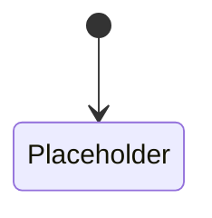
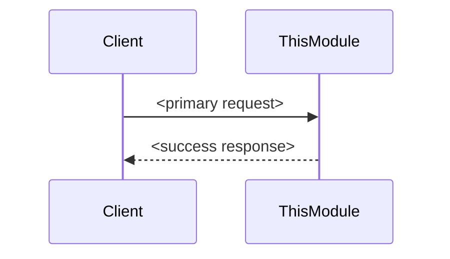
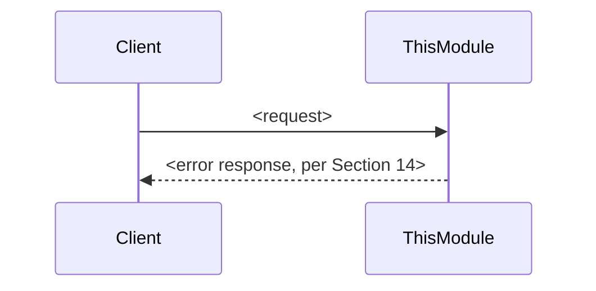
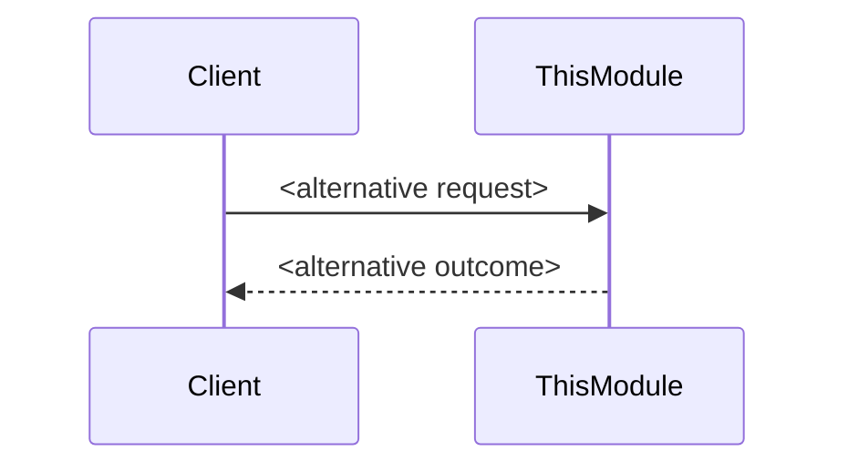
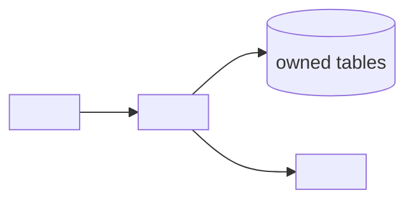

# Software Design Document Template — Sakhari Ecom

| | |
|---|---|
| **Version** | 1.0 |
| **Status** | Authored. Canonical — every future module SDD MUST be produced by copying this file and completing it, never by starting a module SDD from a blank document or a different structure. |
| **Owner** | Architecture (this template is a governance artifact, on the same footing as an ADR's process document — see `decisions/README.md` for the analogous pattern). |
| **Authority** | Subordinate to the SRD, the DDD, the ADRs, every `/architecture` document, and `09-engineering-standards/engineering-standards-and-development-guidelines.md` (the ESDG). This template does not decide anything those documents haven't already decided — it is the fill-in-the-blanks shape every module's own SDD takes so that all sixteen read identically. |
| **Applicable ADRs** | All Accepted ADRs apply to every module by default; a completed SDD's own Section 1 lists only the subset that specifically constrains *that* module. |

**Purpose of this document.** The Architecture Phase is complete — the SRD, the DDD, the ADRs, the `/architecture` documents, and the ESDG are all authoritative. What doesn't yet exist is one document per module that takes that architecture and specifies the module's own internals — schemas, endpoints, events, tests — precisely enough that a developer or an AI assistant can implement the whole module without inventing architecture along the way. This file is not a module SDD. It is the **template** every module SDD is produced from: a fixed section list, and for each section, instructions for what belongs there and where its content comes from — never module-specific content itself.

**How to use this template.**
1. Copy this file to `architecture/11-sdd/<module-name>/sdd.md` (or the equivalent module-SDD location `service-decomposition.md`'s module list resolves to) and rename its title to `Software Design Document — <Module Name>`.
2. Complete every section in order. A section with nothing module-specific to add still gets a one-line statement of that fact (e.g., "No additional invariants beyond the ESDG's Domain Model Standards apply to this module") — never a silently deleted section, because a missing section is indistinguishable from a forgotten one.
3. Cite, don't repeat. Wherever the ESDG, an ADR, or an architecture document already states a rule, the SDD names it by exact path/section (Documentation Standards, ESDG Section 21) and states only the module-specific application of that rule — the module's own tables, its own endpoint list, its own event payloads.
4. Run the Completion Checklist (Section 24) before treating the SDD as ready for implementation.
5. Keep the SDD current. A change that reveals a gap in the module's own SDD updates the SDD in the same change (ESDG Section 22's Definition of Done) — an SDD documents what a module *is*, not what it was when first written.

**Non-negotiable structural rule.** Every module's SDD MUST use the exact 24 sections below, in this order, with these exact headings. A module that has "nothing to say" in a section says so explicitly rather than renumbering, omitting, merging, or reordering sections — identical structure across all sixteen modules is the entire point of this template (see Objective, task instructions this document was produced from).

---

## 1. Document Information

**What goes here:** the module SDD's own version-control metadata — the same shape as this template's own header table above.

| Field | Guidance |
|---|---|
| Version | Start at `0.1` while drafting; `1.0` at first Accepted state. Increment per the same discipline `decisions/README.md` uses for ADRs — a version bump is a real content change, not a typo fix. |
| Status | One of `Draft`, `In Review`, `Accepted`, `Superseded by <module>/sdd.md vN` — mirroring the ADR lifecycle (ESDG Section 21's SDD citation rule). |
| Owner | The engineer or AI-assisted work session responsible for the module's design; for a solo-developer project, a note on who authored/last revised it is sufficient. |
| Last Updated | `YYYY-MM-DD`, updated every time the document changes — never left stale relative to git history. |
| Related Documents | Exact paths: the SRD section(s) this module realizes, the DDD entities this module owns, `03-decomposition/module-catalog.md`'s entry for this module, `03-decomposition/service-decomposition.md`'s entry, `03-decomposition/data-ownership-map.md`'s entry, and any `04-cross-cutting/` document with a module-specific subsection (e.g., Payment cites `data-architecture.md` Section 8A). |
| Applicable ADRs | Every ADR this module's design must comply with by name and number (`ADR-0019` — ULIDs, `ADR-0029` — outbox, plus any module-specific ADR such as `ADR-0037` for Payment). Not a copy of the full ADR index — only the ones that actually bind this module's decisions. |
| Dependencies | The module's declared dependencies exactly as `module-catalog.md`/`service-decomposition.md`'s dependency matrix already states them — never a new dependency invented here (ESDG Section 24's "AI MUST NOT bypass module boundaries"). |

---

## 2. Purpose

**What goes here:** why this module exists, in terms the SRD and `capability-boundary-map.md` already establish — never a new justification invented at SDD time.

- **Business purpose** — the one or two sentences from the SRD/`capability-boundary-map.md` stating what business problem this module solves. Quote or closely paraphrase; don't rederive.
- **Business capability** — the exact capability name `capability-boundary-map.md` assigns this module.
- **Module scope** — the boundary of what this SDD covers, matching `module-catalog.md`'s responsibility list for this module exactly.
- **Non-goals** — what this module explicitly does not do, especially anything a reader might assume it does based on an adjacent module's responsibilities (cite the neighboring module that actually owns it, per `data-ownership-map.md`).

*Placeholder: `<insert business purpose, capability name, scope statement, and non-goals for this module, each traceable to a specific SRD/architecture citation>`*

---

## 3. Responsibilities

**What goes here:** the module's responsibility boundary, at the level of detail `module-catalog.md` Section "How to Read Each Module Entry" already prescribes — this section makes it SDD-local rather than requiring a second lookup.

| Subsection | Guidance |
|---|---|
| Owns | The entities/data/decisions this module is the sole source of truth for (`data-ownership-map.md`'s ownership column for this module, restated here for locality). |
| Does Not Own | The adjacent entities/decisions a reader might mistake as this module's, with the actual owner named (prevents the exact ambiguity `03-decomposition/module-catalog.md` Section 3's Module Ownership Reconciliation exists to close). |
| Public Responsibilities | What this module exposes to the rest of the system — its public interface surface, matching Section 5's Public API and `service-decomposition.md`'s Public Services list for this module. |
| Internal Responsibilities | What this module does that no other module ever calls directly — internal orchestration, domain logic, background jobs owned by this module alone. |

*Placeholder: `<insert this module's Owns / Does Not Own / Public / Internal responsibilities, each citing the architecture document it's drawn from>`*

---

## 4. Module Context

**What goes here:** this module's place in the system, restating (not re-deciding) `module-communication.md`'s dependency graph and `capability-boundary-map.md`'s interaction examples for this module specifically.

- **Neighbouring modules** — every module this one directly depends on or is depended on by (`service-decomposition.md`'s Service Dependency Matrix row/column for this module).
- **Dependencies** — outbound: what this module calls and why, matching Section 1's Dependencies field.
- **Consumers** — inbound: what other modules or client applications call this module's public interface.
- **External integrations** — any row in the ESDG Section 15 table this module owns (e.g., Payment owns the Moyasar row) — cited, not re-specified; module-specific detail (which endpoint calls Moyasar, for what) goes here.
- **Context diagram placeholder** — a Mermaid diagram (per `diagrams/README.md`'s diagrams-as-code convention) showing this module as the center, its dependencies, consumers, and external integrations as surrounding nodes.

*Placeholder: `<insert this module's neighbouring modules, dependencies, consumers, and external integrations, each citing the document it's drawn from>`*

---

## 5. Public API

**What goes here:** the module's REST surface, built entirely on the ESDG Section 5 (API Standards) and Section 6 (DTO Standards) conventions — this section names the module's own endpoints and payloads; it never restates the URI/status-code/pagination/versioning rules themselves.

| Element | Guidance |
|---|---|
| REST endpoints | One row per endpoint: method, path (per ESDG Section 5 URI rules), purpose, calling application-service (Section 9). |
| Request DTOs | Named per ESDG Section 4/6 (`<Verb><Entity>Dto`); field list and validation rules (Section 6/7 below) live with the DTO, not duplicated here beyond a summary. |
| Response DTOs | Named per the same convention; note where RBAC (Section 13) causes role-dependent shapes (ESDG Section 6). |
| Authentication | Confirm every endpoint requires `Authorization: Bearer` (ESDG Section 5/10) unless a specific, named exception applies (e.g., a public catalog read) — state the exception explicitly if one exists. |
| Authorization | The named permission (ESDG Section 10's `<resource>:<operation>` catalogue) each endpoint requires, plus whether store scope (ADR-0041) applies. |
| Validation | Which ESDG Section 7 category (input/business/database) each endpoint's checks fall into, with the module-specific business rules named. |
| Status codes | Confirm this module's endpoints use only ESDG Section 5's defined status-code set, with the module-specific business-error codes (Section 8 below) mapped to each. |
| Pagination | Cursor or offset per ESDG Section 5, per collection endpoint. |
| Versioning | The version this module's endpoints ship at (`/v1/...` at minimum) and any endpoint already carrying a second version. |
| Idempotency | Which endpoints require `Idempotency-Key` per ESDG Section 5/`data-architecture.md` Section 13, and this module's own idempotency-key scope. |
| OpenAPI notes | Confirmation the module's DTOs generate the OpenAPI spec (ESDG Section 5) — no hand-maintained spec drift. |

*Placeholder: `<insert this module's full endpoint table, request/response DTO list, and the authorization/validation/idempotency mapping per endpoint>`*

---

## 6. Domain Model

**What goes here:** this module's own entities exactly as the DDD defines them, expressed per the ESDG Section 13 (Domain Model Standards) rules — this section never redefines what an entity *is*; it states how the DDD's definition becomes this module's code.

| Element | Guidance |
|---|---|
| Aggregates | This module's aggregate roots and their consistency boundary (ESDG Section 13/`data-architecture.md` Section 5). |
| Entities | Child entities per aggregate, with the DDD section each is drawn from cited. |
| Value Objects | Money, phone number, address, or module-specific value objects, each with its enforced invariant (ESDG Section 13). |
| Enums | Every enum this module owns (e.g., an order status enum), matching the DDD/`module-catalog.md`'s naming exactly. |
| Domain Services | Module-internal business logic that doesn't belong to one entity (ESDG Section 13). |
| Factories | Which aggregates require factory-enforced construction invariants, and what those invariants are. |
| Invariants | Every rule that must always hold for this module's entities (ESDG Section 13's "on-hand quantity never negative" pattern) — the actual list for this module. |
| Lifecycle | Reference to Section 12 (State Machines) for full transition detail; this subsection states which entities have a lifecycle at all. |

*Placeholder: `<insert this module's aggregates, entities, value objects, enums, domain services, factories, invariants, each citing the DDD section it realizes>`*

---

## 7. Database Design

**What goes here:** this module's owned tables, built entirely on ESDG Section 11 (Database Standards) — naming, ULIDs, money, timestamps, soft-delete-vs-lifecycle, migrations are governed there and cited, not restated.

| Element | Guidance |
|---|---|
| Owned tables | Every table this module owns per `data-ownership-map.md`, named per ESDG Section 4 (`snake_case`, plural). |
| Columns | Full column list per table, with type, nullability, default. |
| Relationships | Foreign keys to this module's own tables, and (rarely, and only where `data-ownership-map.md` permits) a reference to another module's ID as an opaque value, never a cross-module join. |
| Indexes | Per ESDG Section 11's rule (every FK, every latency-sensitive filter/sort column, every uniqueness rule) — named `idx_<table>_<column(s)>`. |
| Constraints | `pk_`/`fk_`/`uq_`/`chk_` per ESDG Section 4's naming convention, with the business invariant each `chk_` constraint backstops (Section 6 above). |
| Audit fields | Confirm `created_at`/`updated_at` at minimum, plus any domain-specific timestamp (ESDG Section 11). |
| Money fields | Confirm every monetary column is integer halala (ADR-0015) — name them explicitly. |
| ULIDs | Confirm every primary key is a ULID (ADR-0019) — this is restated here, per the ESDG's own "cannot be over-stated" framing (ESDG Section 11), as a required explicit confirmation, not an assumption. |
| Migrations | Reference to the ESDG Section 11 migration-strategy rule; module-specific note only if this module's migrations have an unusual sequencing dependency on another module's schema. |
| Ownership | One-line confirmation this table list matches `data-ownership-map.md` exactly — any divergence is a defect in one of the two documents, flagged and resolved, never left inconsistent. |

*Placeholder: `<insert this module's table-by-table schema: columns, indexes, constraints, audit/money/ULID fields>`*

---

## 8. Repository Layer

**What goes here:** this module's repositories, built on ESDG Section 12 (Repository Standards) — the rules (data-access only, no business logic, no cross-repository queries, transaction-context acceptance) are cited, not repeated; this section names the module's actual repositories and their query surface.

| Element | Guidance |
|---|---|
| Repositories | One per aggregate root (ESDG Section 4 naming: `<Aggregate>Repository`). |
| Queries | The actual query methods each repository exposes, named mechanically (ESDG Section 12's `findByOrderIdAndStatus`, not a business-judgment name). |
| Transactions | Which repository methods must run inside a transaction the calling service establishes (Section 11 below), per ESDG Section 11/12. |
| Read Models | Any dedicated read-oriented repository or projection this module introduces (ESDG Section 12), and what rebuilds it if it's a projection. |
| Caching | Any Redis-backed acceleration this module's repository layer uses, passing the "would losing this on a flush lose a business fact" test (ESDG Section 17/`data-architecture.md` Section 3). |

*Placeholder: `<insert this module's repository list and query surface>`*

---

## 9. Service Layer

**What goes here:** this module's business logic layer, split per ESDG Section 3's `application-service/` vs. `service/` (domain) folders — this section names the actual services and use cases; the layering rule itself is cited from the ESDG.

| Element | Guidance |
|---|---|
| Application Services | Orchestrate across this module's own domain services/repositories for one use case (ESDG Section 3) — list each, with the endpoint(s) that call it. |
| Business Services | Domain-layer services holding the actual business logic (ESDG Section 13's Domain Services, restated here in the service-layer view). |
| Use Cases | One entry per distinct business operation this module performs, mapped to the application service that implements it. |
| Validation | Which business-validation rules (ESDG Section 7) live in this layer, per use case. |
| Business Rules | The module-specific rules from the SRD/DDD this layer enforces — cite the SRD business-rule ID (e.g., `BR-017`) where one exists. |

*Placeholder: `<insert this module's application services, business services, use cases, and the business rules each enforces>`*

---

## 10. Events

**What goes here:** this module's published/consumed events, built on ESDG Section 14 (Event Standards) and `integration-and-messaging.md` — naming, outbox, idempotency, retry, ordering rules are cited; this section lists the module's actual events and payloads.

| Element | Guidance |
|---|---|
| Published Events | Every event this module publishes, named `<Entity><PastTenseVerb>` (ESDG Section 4), matching `module-catalog.md`'s Published Events list for this module exactly. |
| Consumed Events | Every event this module subscribes to, matching `module-catalog.md`'s Consumed Events list. |
| Payload | The actual field list per event — matching the entity/DTO shape it's drawn from, money as integer halala, timestamps UTC, IDs as ULIDs. |
| Idempotency | How this module's consumers determine "already handled this occurrence" (ESDG Section 14) — the specific mechanism (a processed-event-ID table, a natural idempotency key) this module uses. |
| Retry behaviour | This module's consumer retry bound and failure-surfacing behavior (ESDG Section 14), if it differs from or specializes the general rule. |
| Ordering | Any entity-lifecycle ordering assumption this module's consumers rely on (ESDG Section 14's "consumer's own logic tolerates or correctly sequences" rule) — name the specific sequencing this module's logic depends on, if any. |

*Placeholder: `<insert this module's published/consumed event list with payload shapes>`*

---

## 11. Transactions

**What goes here:** this module's transaction boundaries, built on ESDG Section 11's transaction/locking rules and `data-architecture.md` Section 13 — cited, not restated; this section states which of this module's own workflows are transactional and how.

| Element | Guidance |
|---|---|
| Transaction boundaries | Which multi-write workflows in this module run inside one database transaction (never spanning another module's tables — ESDG Section 11). |
| Compensation | For any cross-module operation this module participates in, how compensation works if a later step fails (`module-communication.md` Section 8), from this module's own side. |
| Concurrency | Optimistic vs. pessimistic strategy per workflow (ESDG Section 11) — state which this module's workflows use and why, if it deviates from the optimistic default. |
| Locking | This module's own fixed lock-ordering sequence, if `data-architecture.md` Section 13 defines one for this module (e.g., Inventory's Item → Reservation → Ledger) — cited exactly, never invented fresh. |
| Isolation | The database isolation level this module's transactions rely on, if a specific level (beyond the database default) is required for a named workflow's correctness. |

*Placeholder: `<insert this module's transaction boundaries, concurrency strategy, and lock order>`*

---

## 12. State Machines

**What goes here:** the full lifecycle of every stateful entity this module owns, matching the DDD's state machine definitions and the SRD's business rules for each transition exactly — this is the section most likely to be checked line-by-line against the SRD, so precision here matters more than brevity.

| Element | Guidance |
|---|---|
| Entity lifecycle | One state diagram (Mermaid, per `diagrams/README.md`) per stateful entity this module owns. |
| Allowed transitions | The full transition table: from-state, to-state, triggering condition, triggering actor/event. |
| Forbidden transitions | Explicitly named non-transitions a reader might otherwise assume are possible — especially any the SRD explicitly forbids. |
| Terminal states | Which states are terminal (no further transition), and what "terminal" means for retention (ESDG Section 11's soft-delete/lifecycle/append-only categories). |

*Placeholder: `<insert full transition table per stateful entity>`*

---

## 13. Security

**What goes here:** this module's application of the ESDG Section 10 (Security Standards) and `security-and-compliance.md` — the rules themselves are cited; this section states which of this module's operations they apply to and how.

| Element | Guidance |
|---|---|
| Authentication | Confirm every endpoint requires a valid session (ESDG Section 10) unless explicitly exempted (Section 5 above). |
| Authorization | The full list of named permissions (`<resource>:<operation>`) this module introduces or checks. |
| RBAC | Which roles hold which of this module's permissions, per `security-and-compliance.md` Section 7's catalogue. |
| Store scope | Whether this module's operations are store-scoped (ADR-0041), and which entity carries the store reference used for the scope check. |
| Step-up authentication | Whether any of this module's operations fall under the ESDG Section 10 named five (refund approval, permission changes, settings changes, financial ledger adjustments, sensitive audit access) — if so, name the operation and confirm the step-up call. |
| Audit | Which of this module's operations write an Audit Log entry (`security-and-compliance.md` Section 9/DDD Section 12.6), distinct from application logging (ESDG Section 9). |
| PII | Any PII field this module stores or processes, its masking treatment (ESDG Section 9), and its retention/purge category (ESDG Section 10). |

*Placeholder: `<insert this module's permission list, RBAC mapping, store-scope rule, step-up operations, audit points, and PII fields>`*

---

## 14. Error Handling

**What goes here:** this module's specific error codes, built on the ESDG Section 8 standard envelope and category table — cited, not restated; this section lists the module's own `code` values.

| Category (ESDG Section 8) | This module's specific codes |
|---|---|
| Validation errors | `<list this module's field-level validation error codes>` |
| Business errors | `<list this module's named business-rule rejection codes, e.g. INSUFFICIENT_STOCK>` |
| Infrastructure errors | Confirm this module surfaces these per the ESDG's generic handling — no module-specific code needed unless the failure mode is unusual. |
| External provider failures | Only if this module owns a row in ESDG Section 15's integration table — list this module's provider-specific error codes. |
| Retry strategy | This module's own retry bound per error category, if it specializes the ESDG default. |

*Placeholder: `<insert this module's error code table>`*

---

## 15. Logging & Observability

**What goes here:** this module's application of ESDG Section 9 (Logging) and `observability-and-operations.md` — the structured-field contract and masking rule are cited, not restated; this section lists what's module-specific.

| Element | Guidance |
|---|---|
| Structured logging | Confirm this module's `operation` field values (the specific method/use-case names logged) — list them. |
| Metrics | This module's entries in the `observability-and-operations.md` metrics catalog. |
| Tracing | Any module-specific span/correlation-ID propagation detail beyond the standard rule (ESDG Section 9). |
| Health checks | This module's health-check endpoint/criteria, if it has a dependency (a specific external provider, Section 4 above) whose health should be reflected. |
| Alerts | This module's entries in `observability-and-operations.md`'s alerting tiers. |
| Audit logging | Reference back to Section 13 — not repeated here. |

*Placeholder: `<insert this module's specific log operations, metrics, health checks, and alerts>`*

---

## 16. Performance

**What goes here:** this module's application of ESDG Section 17 (Performance Standards) — the latency table and general rules (no unbounded query, caching test, pagination, N+1 prevention) are cited; this section states module-specific numbers and hotspots.

| Element | Guidance |
|---|---|
| Expected latency | This module's endpoints mapped to the ESDG Section 17 latency table's path categories — call out any endpoint needing its own target beyond the general one. |
| Caching | This module's specific cache entries (what's cached, key shape, invalidation trigger), passing the ESDG/`data-architecture.md` caching test. |
| Indexes | Cross-reference to Section 7 — not repeated here. |
| Scalability | Any module-specific scaling concern (a hot partition, a write-heavy table) beyond the general horizontal-scaling story in `reliability-and-performance.md`. |
| Memory considerations | Any background job or report path in this module that must stream/batch per ESDG Section 17 — name it. |

*Placeholder: `<insert this module's latency targets, cache entries, and scalability notes>`*

---

## 17. Sequence Diagrams

**What goes here:** Mermaid sequence diagrams (per `diagrams/README.md`) for this module's key flows — one concern per diagram (ESDG/diagram convention), drawn after the rest of this SDD has stabilized (README.md Section 4's "diagrams last" ordering, applied at SDD scale).

---

## 18. Data Flow Diagram

**What goes here:** one Mermaid diagram (per `diagrams/README.md`) showing how data moves through this module — inbound request/event sources, this module's own tables, outbound events/responses. Complements Section 4's context diagram (module-to-module) with an internal, data-centric view.

---

## 19. Testing Strategy

**What goes here:** this module's application of ESDG Section 16 (Testing Standards) — the test-type definitions and mocking/fixture rules are cited; this section names what specifically must be tested for this module.

| Test type (ESDG Section 16) | This module's specific scope |
|---|---|
| Unit tests | This module's business rules requiring proof (e.g., "an order cannot be placed against insufficient stock" — the module-specific equivalent). |
| Integration tests | This module's persistence/transaction behaviors requiring proof against a real database (Section 11 above). |
| Contract tests | This module's public API/event contract (Sections 5, 10 above) requiring protection against silent breakage. |
| API tests | This module's endpoints requiring full request/response-cycle proof, including auth/RBAC (Section 13). |
| Repository tests | This module's queries/constraints (Section 7, 8 above) requiring proof against a real database. |
| Edge cases | This module's specific edge cases (boundary quantities, expired states, empty collections). |
| Race conditions | Any named race condition `data-architecture.md` Section 13 identifies for this module's workflows — list each, with the test that proves the guarantee holds (ESDG Section 16's explicit floor). |

*Placeholder: `<insert this module's specific test scope per type>`*

---

## 20. Configuration

**What goes here:** this module's configuration surface, built on ESDG Section 3's Configuration rule (typed surface, Settings-owned business tunables, no ad hoc `process.env` reads) — cited, not restated; this section lists the module's actual configuration values.

| Element | Guidance |
|---|---|
| Feature flags | Any flag gating a feature in this module, and its current default. |
| Settings | Business-tunable defaults this module reads from the Settings module (ESDG Section 3/ADR-0033) — name each, with its fallback default if Settings is unavailable. |
| Environment variables | This module's own environment variables, `UPPER_SNAKE_CASE`, prefixed by concern (ESDG Section 4) — infrastructure-level only, never a business tunable (that's Settings, above). |
| Secrets | Any secret this module's external integration (Section 4) requires, confirmed to live only in AWS Secrets Manager (ESDG Section 10) — name the secret's purpose, never its value. |

*Placeholder: `<insert this module's feature flags, Settings-sourced values, environment variables, and secrets by name/purpose only>`*

---

## 21. Operational Considerations

**What goes here:** this module's application of `observability-and-operations.md`'s operational practice — the general runbook/backup/DR framework is cited; this section states what's specific to this module.

| Element | Guidance |
|---|---|
| Monitoring | Cross-reference to Section 15 — not repeated here. |
| Recovery | This module's specific recovery procedure if its own workflow fails mid-flight (e.g., a stuck reservation, an unconfirmed payment) — beyond the general infrastructure DR story. |
| Maintenance | Any module-specific maintenance task (a scheduled reconciliation job, a batch-formation evaluation) and its cadence. |
| Backups | Confirmation this module's data is covered by the standard PostgreSQL backup/DR policy (`infrastructure-and-release.md`) — note only if this module has an unusual retention or restore-verification need. |
| Runbooks | This module's entries in the runbook categories `observability-and-operations.md` defines — name them, don't duplicate their content here. |

*Placeholder: `<insert this module's specific operational procedures>`*

---

## 22. Open Decisions

**What goes here:** anything this SDD deliberately leaves unresolved — carried forward explicitly, never silently decided, per the same discipline the architecture documents' own Open Decisions sections already model (README.md Section 5, ESDG's own Open Decisions section).

- **Future improvements** — a known enhancement out of scope for the current implementation.
- **Deferred decisions** — a choice this SDD punts on, with the condition that would force resolving it.
- **Known limitations** — a constraint this module's current design accepts, and why.

*Placeholder: `<insert this module's genuinely open items — empty is a valid, stated answer: "No open decisions beyond those already carried in the architecture documents this SDD cites">`*

---

## 23. Traceability

**What goes here:** a table mapping every requirement this module implements back to its source — the mechanism that makes this SDD auditable against the documents it claims to satisfy, extending the citation discipline every architecture document already follows (README.md Section 3).

| Requirement / Rule | SRD | DDD | ADR(s) | Architecture Document(s) | ESDG Section |
|---|---|---|---|---|---|
| `<one row per distinct requirement or business rule this module implements>` | `<SRD section/FR/BR ID>` | `<DDD entity/section>` | `<ADR-NNNN>` | `<path#section>` | `<ESDG section #>` |

*Placeholder: `<insert one row per requirement; an empty cell means that source genuinely doesn't apply to this row, not an unchecked lookup>`*

---

## 24. Completion Checklist

**What goes here:** the gate an SDD passes before implementation begins — parallel to, and layered under, the ESDG's own Definition of Done (ESDG Section 22) and Developer Checklist (ESDG Section 23), which govern the *code* built from this SDD. This checklist governs the *document* itself.

- [ ] **Architecture compliant** — every section cites, and does not contradict, the SRD/DDD/ADRs/architecture documents named in Section 1.
- [ ] **ESDG compliant** — no section restates an ESDG rule instead of citing it; no module-specific choice contradicts an ESDG MUST-level rule without a flagged, documented exception.
- [ ] **API documented** — Section 5 is complete and consistent with what the OpenAPI spec will generate.
- [ ] **Tests defined** — Section 19 names concrete test scope per type, including every race condition/idempotency case Section 11/10 identifies.
- [ ] **Diagrams completed** — Sections 4, 12, 17, 18 have real diagrams, not placeholders.
- [ ] **Security reviewed** — Section 13 names every permission, store-scope rule, step-up operation, audit point, and PII field this module touches.
- [ ] **Performance reviewed** — Section 16 states latency targets and caching for every latency-sensitive path.
- [ ] **Ready for implementation** — every section above has module-specific content (or an explicit "not applicable" statement) — no section is a leftover placeholder from this template.

---

## Open Decisions

Carried forward, not newly introduced, from the documents this template builds on:

- **Exact SDD file location and per-module folder numbering** (e.g., `architecture/11-sdd/<module>/`) is not yet fixed — the first module SDD authored using this template should establish the convention, which this template will then be updated to state precisely (README.md Section 21's documentation-standards rule for structural changes applies to that update).
- **SDD-level code-coverage thresholds, test framework, linter/formatter** — inherited, unresolved, from ESDG Section 16/18/24 (Open Decisions) — a per-module SDD does not resolve these itself.
- Every Open Decision already carried by the ESDG (ESDG's own Open Decisions section) and by the architecture documents it operationalizes applies unchanged to every module SDD produced from this template.
