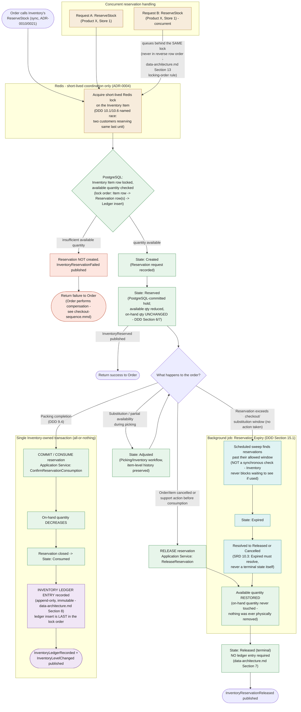
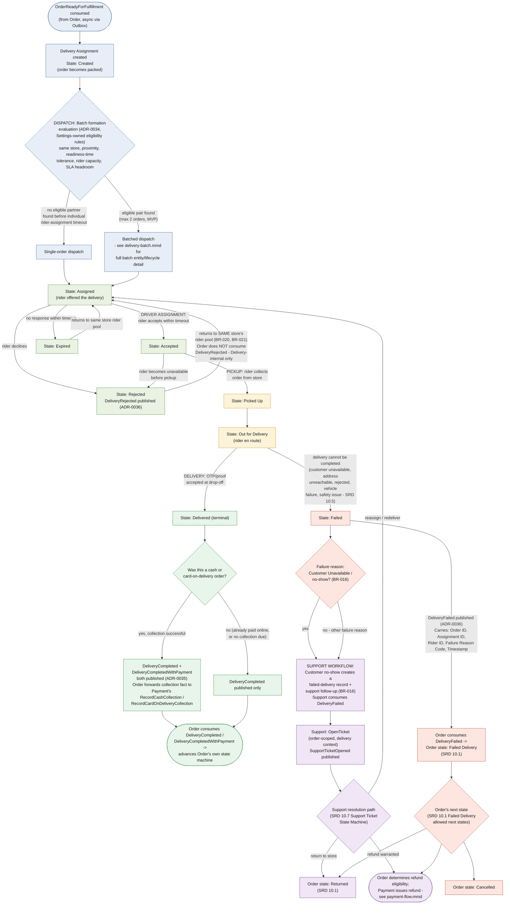
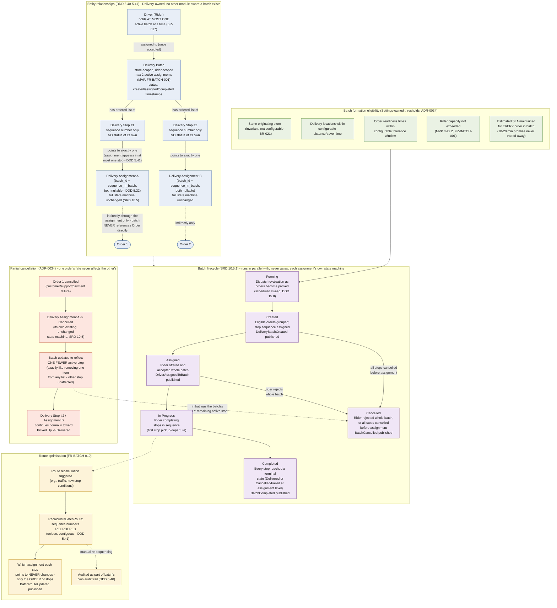

```mermaid
flowchart TD
    init(["Order calls Payment's\nInitiatePayment (sync, checkout step)"]) --> pending["Payment state: Pending\n(Payment-owned transaction, ADR-0021)"]

    pending --> methodChoice{"Payment method\n(selected at checkout)"}

    subgraph ONLINE["Online Payment (mada / card / Apple Pay / BNPL) - ADR-0022"]
        methodChoice -->|"Online"| gwCall["Payment -> Moyasar Payment Gateway\n(sole external caller, ADR-0022)"]
        gwCall -->|"verified gateway response"| authState["State: Authorized"]
        authState -->|"PaymentAuthorized published"| captureState["State: Captured\n(verified gateway capture)"]
        gwCall -.->|"decline/timeout (ADR-0032\nretry/circuit-breaker)"| onlineFail["State: Failed\nPaymentFailed published"]
    end

    subgraph COD["Cash on Delivery"]
        methodChoice -->|"COD"| codPending["State: COD Pending\n(checkout flow, no online capture)"]
        codPending -.->|"rider collects cash at drop-off\n(ADR-0035: Delivery publishes\nDeliveryCompletedWithPayment;\nOrder forwards to Payment)"| codCollect["Payment: RecordCashCollection\n(Payment-owned txn)"]
    end

    subgraph CARDCOD["Card on Delivery (POS/terminal)"]
        methodChoice -->|"Card-on-Delivery"| cardPending["State: Card-on-Delivery Pending\n(checkout flow)"]
        cardPending -.->|"rider/terminal collects at drop-off\n(ADR-0035, same forwarding path)"| cardCollect["Payment: RecordCardOnDeliveryCollection\n(Payment-owned txn)\nMVP: manual settlement import +\ndiscrepancy review (ADR-0032/0033)"]
    end

    captureState -->|"PaymentCaptured published"| paidState
    codCollect -->|"CashRemittanceRecorded published"| paidState
    cardCollect --> paidState
    paidState["State: Paid\n(payment obligation satisfied)"]

    paidState --> ledgerBranch

    subgraph LEDGER["Payment Ledger (ADR-0037) - append-only, immutable, mirrors Inventory Ledger"]
        ledgerBranch["Every financial movement writes\na Payment Ledger entry:\nPayment Authorized, Payment Captured,\nCOD Collected, Card-on-Delivery Collected,\nRefund Issued, Refund Reversed,\nSettlement Recorded, Adjustment, Chargeback"]
        ledgerBranch --> ledgerNote["Payment's current authorized/captured/\nrefunded totals derive from ledger history\n(fast-path 'what is true now')"]
    end

    ledgerBranch -->|"PaymentLedgerRecorded published\n(entry per movement)"| settleRecon

    subgraph RECON["Settlement & Reconciliation (ADR-0037, data-architecture.md 8A)"]
        settleRecon["Scheduled reconciliation job compares\nledger movements against provider\nsettlement reports (Moyasar, ADR-0022;\nPOS/terminal, ADR-0032)"]
        settleRecon -->|"match"| settled["Settlement Recorded\n(ledger entry)"]
        settleRecon -->|"discrepancy"| flagged["Flagged for manual review\n(never silently accepted/auto-corrected)"]
    end

    paidState --> refundTrigger{"Refund needed?\n(Order-owned eligibility rules,\nor Support-initiated - ADR-0033)"}

    refundTrigger -->|"no"| doneState(["No refund - Payment lifecycle ends at Paid"])

    subgraph REFUND["Refund / Partial Refund (SRD 10.8, ADR-0038 line-item aware)"]
        refundTrigger -->|"yes"| requested["Refund state: Requested\n(references Order Item(s) + quantity +\nOriginal Unit Price from Order's\nPrice Snapshot - NEVER current catalog price)"]
        requested --> pendingApproval["State: Pending Approval"]
        pendingApproval -->|"rejected"| rejected["State: Rejected (terminal)"]
        pendingApproval -->|"approved\n(Order rule or authorized Support flow)"| approved["State: Approved"]
        approved --> processing["State: Processing\n(RefundOrchestrationService computes\nper-line breakdown: proportional or\nfull-line reversal - ADR-0038)"]
        processing -->|"settlement/manual resolution fails\nRefundFailed published"| refundFailed["State: Failed (retryable)"]
        refundFailed --> processing
        processing -->|"success\nRefundIssued published"| completed["State: Completed (terminal)"]
        completed --> cumCheck["Cumulative refunded amount across\nALL non-rejected/cancelled refunds\nfor this order must never exceed\nthe order's paid total (ADR-0038)"]
        cumCheck -.->|"multiple partial refunds\nsupported per order"| requested
    end

    completed -->|"Refund Issued / Refund Reversed\nledger entry"| ledgerBranch

    classDef online fill:#e8eef7,stroke:#4a6fa5,color:#1a1a1a
    classDef cod fill:#eaf2e4,stroke:#5a8f3c,color:#1a1a1a
    classDef cardcod fill:#fdf3d9,stroke:#c99a2e,color:#1a1a1a
    classDef ledger fill:#f0e6f6,stroke:#7c4a9e,color:#1a1a1a
    classDef refund fill:#fde6e0,stroke:#c0533c,color:#1a1a1a
    classDef recon fill:#e0f3f3,stroke:#2f8f8f,color:#1a1a1a

    class gwCall,authState,captureState,onlineFail online
    class codPending,codCollect cod
    class cardPending,cardCollect cardcod
    class ledgerBranch,ledgerNote,settled ledger
    class requested,pendingApproval,approved,processing,refundFailed,completed,cumCheck,rejected refund
    class settleRecon,flagged recon
```

# Sakhari Ecom — Business-Flow Diagrams

| | |
|---|---|
| **Version** | 1.0 |
| **Status** | Generated from the frozen, approved architecture. **No architecture decision was made or changed while producing this document.** Every state, event, entity, and transition below traces to an ADR, the DDD, the SRD, or `04-cross-cutting/data-architecture.md`. |
| **Scope** | Business-flow (runtime behavior) diagrams — distinct from the structural diagrams in `generated-diagrams.md` (system context, container, module dependency, capability map, module communication). These diagrams show *what happens, in what order, and under what failure conditions* for five core workflows. |
| **Source of truth** | `DDD_Sakhari_Ecom_v1.0.md` Sections 5.14–5.15, 5.22, 5.24–5.28, 5.40–5.41, 9, 15; `SRD_Sakhari_Ecom_v2.6_Saudi.md` Section 10 (state machines) and Business Rules; `03-decomposition/module-catalog.md`, `module-communication.md`; `04-cross-cutting/data-architecture.md`; ADR-0010, 0021, 0022, 0029, 0032, 0034–0038. |
| **Diagram source files** | `diagrams/source/checkout-sequence.mmd`, `inventory-reservation-flow.mmd`, `payment-flow.mmd`, `delivery-lifecycle.mmd`, `delivery-batch.mmd` — this document embeds them for convenience; the `.mmd` files are authoritative per `diagrams/README.md`. |

---

## 1. Checkout Sequence

### Purpose
Show the end-to-end checkout flow from a customer's `PlaceOrder` request through inventory reservation, promotion validation, payment initiation, order confirmation, and asynchronous event publishing — including both the synchronous-failure/compensation path and the later, decoupled payment-confirmation path.

### Description
Drawn directly from `module-communication.md` Section 10's Example 1 (the canonical checkout walkthrough) and DDD Section 9.1/9.2's Transaction Boundaries. Checkout is **orchestration with module-local transactions**, never one transaction spanning modules (ADR-0021, clarifying ADR-0010): Order creates its own record, then calls Inventory's `ReserveStock` and Payment's `InitiatePayment` as separate, synchronous, module-owned-transaction steps. A reservation failure triggers Order's own compensating action (cancel the pending order) rather than a database rollback spanning modules — "no confirmed order should remain" (DDD 9.1). Every event (`OrderPlaced`, `PaymentAuthorized`/`PaymentFailed`, `OrderReadyForFulfillment`) is written to the PostgreSQL-backed transactional outbox in the *same* transaction as the entity change it describes (ADR-0029), never as a separate, independently-failable step.

### Mermaid Code

```mermaid
sequenceDiagram
    actor Customer
    participant Order
    participant Cart
    participant Promotion
    participant Inventory
    participant Payment
    participant Outbox as Transactional Outbox
    participant Delivery
    participant Notification

    Customer->>Order: REST PlaceOrder (versioned API, ADR-0017)
    Order->>Cart: sync GetCart
    Cart-->>Order: cart items (customer's selection)

    Note over Order: Order-record creation begins\n(Order-owned transaction, ADR-0021)

    Order->>Promotion: sync EvaluatePromotionEligibility
    Note right of Promotion: PROMOTION VALIDATION
    Promotion-->>Order: eligibility result + discount (or none)

    Order->>Order: Create Order + Order Items + Price Snapshot\n(own txn, not-yet-confirmed state - DDD 9.1)
    Note right of Order: ORDER CREATION

    Order->>Inventory: sync ReserveStock (Inventory-owned txn, ADR-0010/0021)
    Note right of Inventory: INVENTORY RESERVATION\nRedis lock precheck, then\nPostgreSQL-committed reservation (DDD 9.2)

    alt Reservation fails (e.g. out of stock)
        Inventory-->>Order: InventoryReservationFailed
        Note over Order: FAILURE HANDLING + COMPENSATION (ADR-0021)\nOrder cancels the pending order it just created.\n"No confirmed order should remain" (DDD 9.1 rollback expectation).
        Order->>Order: Order state -> Cancelled (compensating action, own txn)
        Order-->>Customer: checkout failed (stock unavailable)
    else Reservation succeeds
        Inventory-->>Order: InventoryReserved
        Order->>Payment: sync InitiatePayment (Payment-owned txn, ADR-0021)
        Note right of Payment: PAYMENT\nOnline: Authorized/Pending via Moyasar (ADR-0022)\nCOD / Card-on-Delivery: recorded Pending\nwithin same transactional flow (ADR-0010)

        alt Payment initiation fails
            Payment-->>Order: PaymentFailed (initiation rejected)
            Note over Order: FAILURE HANDLING + COMPENSATION (ADR-0021)\nOrder compensates: instructs Inventory to\nReleaseReservation, then cancels the order.
            Order->>Inventory: sync ReleaseReservation (compensating call)
            Inventory-->>Order: InventoryReservationReleased
            Order->>Order: Order state -> Cancelled (compensating action)
            Order-->>Customer: checkout failed (payment could not be initiated)
        else Payment initiation accepted (Authorized / COD-Pending / CoD-Pending)
            Order->>Order: Order state -> Confirmed\n(payment state recorded in same flow, ADR-0010)
            Order->>Outbox: write OrderPlaced\n(same txn as Order record, ADR-0029)
            Order-->>Customer: checkout succeeded (order confirmed)

            Note over Outbox: EVENT PUBLISHING (ADR-0029)\nOutbox row committed atomically with the\nentity change; background dispatcher delivers\nto consumers with retry/backoff. Publisher never\nwaits on a consumer's reaction.
            Outbox-->>Notification: dispatch OrderPlaced (async)
            Notification->>Notification: SendNotification (order confirmation)

            par Later, decoupled from the original request/response (gateway async resolution)
                Payment->>Outbox: write PaymentAuthorized / PaymentFailed\n(gateway callback resolved, Payment-owned txn)
                Outbox-->>Order: dispatch PaymentAuthorized / PaymentFailed (async)
                alt PaymentAuthorized
                    Order->>Order: update order status accordingly
                else PaymentFailed (post-initiation failure)
                    Note over Order: FAILURE HANDLING (async path)\nOrder transitions toward Payment Failed / Cancelled\nper SRD 10.1/10.2 - resolved by Order's own\nstate machine, not a new compensation call.
                    Order->>Order: Order state -> Payment Failed
                end
            end

            Order->>Outbox: write OrderReadyForFulfillment\n(once payment confirmed)
            Outbox-->>Delivery: dispatch OrderReadyForFulfillment (async)
            Delivery->>Delivery: begin picking-session orchestration\n(Delivery-owned txn, outside Order's request/response cycle)
        end
    end
```

### Rendering Notes
- The two `alt` failure branches are the diagram's explicit **Failure Handling + Compensation** content — both follow ADR-0021's orchestration-with-compensation pattern, never a cross-module database rollback.
- The `par` block renders the asynchronous, decoupled-in-time payment-confirmation path distinctly from the synchronous checkout request/response — this is a deliberate architectural fact (module-communication.md §10, step 8), not a diagram simplification.
- Cash-on-delivery/card-on-delivery collection at drop-off (ADR-0035) is out of this diagram's scope — it happens after `OrderReadyForFulfillment`, during delivery; see `delivery-lifecycle.mmd` and `payment-flow.mmd`.

### Referenced ADRs
ADR-0010 (transactional checkout, historical — clarified by), ADR-0021 (checkout transaction boundary clarification — operative rule), ADR-0017 (versioned APIs), ADR-0022 (Moyasar), ADR-0029 (transactional outbox), ADR-0011 (event-driven asynchronous side effects).

### Referenced Documents
`03-decomposition/module-communication.md` Section 10 (Example 1 — primary source), DDD Section 9.1 (Order Creation), Section 9.2 (Inventory Reservation), `03-decomposition/module-catalog.md` Sections 4.6–4.9 (Public Interfaces, Published/Consumed Events).

---

## 2. Inventory Reservation Flow

### Purpose
Show how a stock reservation is created, held, committed (consumed), released, or expired — including the Redis-coordinated concurrency mechanism that prevents two customers from reserving the same last unit, and exactly when an Inventory Ledger entry is (and is not) written.

### Description
Drawn from `data-architecture.md` Sections 6–8 and 13, DDD Section 9.2/15.1/5.14–5.15, and the SRD's Inventory Reservation State Machine (Section 10.3). Three distinct entities — Inventory Item (current state), Inventory Reservation (in-flight claim), Inventory Ledger (historical movement) — divide responsibility so a single mutable quantity never has to represent "spoken for but not yet shipped." Redis provides a short-lived lock only to coordinate *who gets to attempt* a reservation first; the reservation itself is not real until committed in PostgreSQL (ADR-0004). A ledger entry is written **only** at consumption (packing completion) — release and expiry restore availability with **no** ledger entry, because nothing was ever physically removed from stock.

### Mermaid Code



### Rendering Notes
- The **Concurrent reservation handling** subgraph shows two competing requests queuing behind the *same* Redis lock — the named DDD 10.6 race condition ("two customers trying to reserve the same last item") — rather than racing PostgreSQL row locks directly, which is the whole point of the Redis precheck.
- **Commit reservation** in the task's request is rendered as the **Consumed** transition (packing completion) — the DDD/SRD do not use the word "commit" for a separate state; "Reserved" (the PostgreSQL-committed hold) and "Consumed" (final stock deduction) are the two commit-adjacent states actually named in the source documents, and both are shown distinctly.
- The dashed feedback loop from `adjusted` back to `branch` reflects that an Adjusted reservation can still proceed to any of Consumed/Released/Expired afterward (SRD 10.3's allowed-next-states for Adjusted).

### Referenced ADRs
ADR-0004 (Redis as cache/coordination only), ADR-0010, ADR-0021.

### Referenced Documents
`04-cross-cutting/data-architecture.md` Sections 6 (Inventory Model), 7 (Reservation Lifecycle), 8 (Inventory Ledger), 13 (Concurrency Strategy — primary source for locking/concurrency detail); DDD Sections 5.14 (Inventory Reservation), 5.15 (Inventory Ledger), 9.2 (Inventory Reservation transaction boundary), 9.4 (Packing Completion), 15.1 (Reservation Expiry background job); SRD Section 10.3 (Inventory Reservation State Machine).

---

## 3. Payment Flow

### Purpose
Show all three payment collection paths (online gateway, cash-on-delivery, card-on-delivery) converging on a single Paid state, how every financial movement produces an immutable Payment Ledger entry, how settlement reconciliation works, and the full (partial-)refund lifecycle.

### Description
Drawn from `module-catalog.md` Section 4.9, ADR-0022 (Moyasar), ADR-0035 (delivery-collected payment), ADR-0037 (Payment Ledger), ADR-0038 (line-item refunds), and the SRD's Payment (10.2) and Refund (10.8) state machines. Online payment is the only path that calls an external gateway (Moyasar) directly; COD and card-on-delivery are collected by the rider and reach Payment only through Order's forwarding of Delivery's `DeliveryCompletedWithPayment` event (ADR-0035) — Delivery never calls Payment directly. Every state-changing operation — authorization, capture, collection, refund, settlement, adjustment, chargeback — writes an append-only Payment Ledger entry (ADR-0037), the same structural mechanism as the Inventory Ledger, applied to money. Refunds are line-item aware (ADR-0038): each refund references specific Order Items at a quantity, priced from the order's frozen Price Snapshot, never recomputed from current catalog price, and multiple partial refunds are supported provided their cumulative amount never exceeds the order's paid total.

### Mermaid Code



### Rendering Notes
- COD and card-on-delivery both reach Payment through the **same** ADR-0035 forwarding path (Delivery → event → Order → Payment's existing interface) — Delivery is deliberately absent from this diagram as a direct actor, consistent with its Forbidden Dependency on Payment (`module-catalog.md` §4.11).
- The refund loop (`cumCheck -.-> requested`) represents that a **new** Refund record is created for each additional partial refund — it is not the same record re-entering `Requested`; the dashed edge marks "another refund may follow," not a literal state re-entry.
- Settlement reconciliation (`RECON` subgraph) is a scheduled job, not a synchronous step in the payment flow — its position after the Ledger subgraph reflects data flow (ledger → reconciled against provider reports), not a request/response sequence.

### Referenced ADRs
ADR-0015 (integer halala money representation), ADR-0021, ADR-0022 (Moyasar), ADR-0032 (external integration resilience — retry/circuit-breaker, POS/terminal settlement), ADR-0033 (refund eligibility ownership, Support-initiated refunds), ADR-0035 (delivery-collected payment event), ADR-0037 (Payment Ledger), ADR-0038 (line-item aware partial refunds).

### Referenced Documents
`03-decomposition/module-catalog.md` Section 4.9 (Payment); `04-cross-cutting/data-architecture.md` Section 8A (Payment Ledger — primary source for ledger/reconciliation detail); SRD Section 10.2 (Payment State Machine), Section 10.8 (Refund State Machine); DDD Sections 5.24–5.28 (Payment, Payment History, Cash Remittance, Card-on-Delivery Record, Refund).

---

## 4. Delivery Lifecycle

### Purpose
Show the full journey of a packed order from dispatch through driver assignment, optional batching, pickup, delivery (or failure/rejection), and — where applicable — the support workflow a failed delivery triggers.

### Description
Drawn from the SRD's Delivery Assignment State Machine (Section 10.5) and Batching Lifecycle (10.5.1), `module-catalog.md` Section 4.11, ADR-0034 (batching), ADR-0035 (delivery-collected payment), and ADR-0036 (failure/rejection events). A rejected or expired assignment always returns to the *same* store's rider pool (BR-020, BR-021) — cross-store reassignment is not allowed in MVP. `DeliveryRejected` is Delivery-internal only (Order never consumes it); `DeliveryFailed` is the event that actually advances Order's own state machine to "Failed Delivery" and is also consumed by Support. A successful delivery publishes `DeliveryCompleted` always, and additionally `DeliveryCompletedWithPayment` when a cash/card-on-delivery collection occurred (ADR-0035). Customer no-show (BR-016) is one specific failure reason among several that all route through the same `DeliveryFailed` → Support-ticket path.

### Mermaid Code



### Rendering Notes
- The `customerUnavail` decision both branches lead to the same `supportFlow` node — this is intentional, not redundant: BR-016 specifically names customer no-show, but `module-catalog.md` §4.13 documents Support consuming `DeliveryFailed` generally, for any failure reason. The diamond exists to call out BR-016 by name without asserting Support only handles no-shows.
- The batching branch (`batchEval`) is deliberately shown at low detail here — full batch entity, lifecycle, partial-cancellation, and route-optimisation detail is `delivery-batch.mmd`'s job, per this document's own "one diagram, one concern" principle.
- `refundPath` and `payment-flow.mmd` are the same downstream flow — cross-referenced rather than duplicated.

### Referenced ADRs
ADR-0034 (delivery batching), ADR-0035 (delivery-collected payment event), ADR-0036 (delivery failure and rejection events).

### Referenced Documents
SRD Section 10.5 (Delivery Assignment State Machine — primary source), Section 10.5.1 (Batching Lifecycle), Section 10.1 (Order State Machine — Failed Delivery states), Section 10.7 (Support Ticket State Machine), Business Rules BR-016, BR-020, BR-021; `03-decomposition/module-catalog.md` Section 4.11 (Delivery), Section 4.13 (Support).

---

## 5. Delivery Batch Diagram

### Purpose
Visualize the Delivery Batch entity's relationships (Driver, Orders, Delivery Stops, Delivery Assignments), its own lifecycle running in parallel with each assignment's unchanged state machine, batch formation eligibility, partial cancellation, and route optimisation.

### Description
Drawn entirely from ADR-0034 and DDD Sections 5.40–5.41. A Delivery Batch is a purely Delivery-internal, operational grouping — it never becomes a second transactional unit spanning orders, and no other module (Order, Payment, Inventory) is ever aware a batch exists. A Delivery Batch references Delivery Stops, each of which points to exactly one Delivery Assignment (and, through it, exactly one order) — the batch never references an Order, Payment, or Inventory Reservation directly. A Delivery Stop deliberately has no status of its own; its completion is read entirely from the Delivery Assignment it references. This is what makes partial cancellation safe by construction: cancelling one order cancels only its own Delivery Assignment (unchanged state machine), and the batch simply reflects one fewer active stop — "exactly the way removing one item from any list doesn't affect the other items" (ADR-0034).

### Mermaid Code



### Rendering Notes
- MVP caps a batch at **two** active assignments (FR-BATCH-001) — this diagram shows exactly two stops/assignments/orders for that reason, not as an arbitrary illustrative choice; a larger batch size is a Settings-configuration change per ADR-0034, not a diagram or architecture change.
- The `ENTITIES -.-> LIFECYCLE` and `inProgress -.-> recalcTrigger` cross-subgraph edges are layout connectors only, showing that the lifecycle and route-optimisation subgraphs relate to the entities/in-progress state above them — they are not new data relationships beyond what DDD 5.40–5.41 already state.
- "Compatible order types" (SRD 10.5.1's sixth eligibility rule) is deliberately omitted from the `ELIGIBILITY` subgraph: the SRD itself states this rule "evaluates as 'always compatible' today" since no order-type incompatibility flag exists in the current data model — it is a placeholder for a future flag, not an active MVP rule, and rendering it as active would misrepresent current behavior.

### Referenced ADRs
ADR-0034 (delivery batching — sole source for this entire diagram), ADR-0002/0009 (referenced within ADR-0034 as the boundaries batching must not violate).

### Referenced Documents
DDD Sections 5.40 (Delivery Batch), 5.41 (Delivery Stop), 5.22 (Delivery Assignment, extended fields), 15.8 (Batch Formation Evaluation background job); SRD Section 10.5.1 (Delivery Batching Lifecycle and Eligibility Rules — primary source for the lifecycle and eligibility subgraphs), FR-BATCH-001, FR-BATCH-008, FR-BATCH-010, BR-017, BR-020, BR-021.

---

## Appendix: Source File Index

| Diagram | Source file | Illustrates (primary document) |
|---|---|---|
| 1. Checkout Sequence | `diagrams/source/checkout-sequence.mmd` | `03-decomposition/module-communication.md` §10 |
| 2. Inventory Reservation Flow | `diagrams/source/inventory-reservation-flow.mmd` | `04-cross-cutting/data-architecture.md` §6-8, 13 |
| 3. Payment Flow | `diagrams/source/payment-flow.mmd` | `03-decomposition/module-catalog.md` §4.9, ADR-0037 |
| 4. Delivery Lifecycle | `diagrams/source/delivery-lifecycle.mmd` | SRD §10.5, ADR-0034/0035/0036 |
| 5. Delivery Batch Diagram | `diagrams/source/delivery-batch.mmd` | ADR-0034, DDD §5.40-5.41 |

All five `.mmd` files carry a header comment naming the document(s) they illustrate and the date last verified against them (2026-07-30), per `diagrams/README.md`'s "Referencing" rule. These are business-flow (runtime behavior) diagrams, distinct from and complementary to the structural diagrams in `generated-diagrams.md`.
