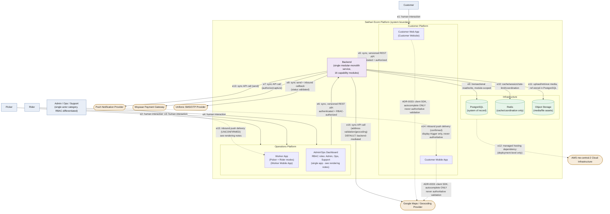
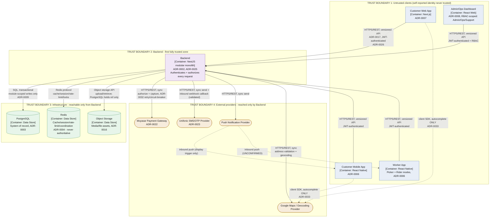
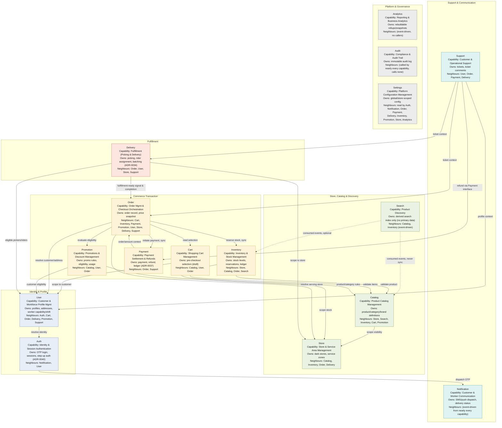

```mermaid
flowchart LR
    subgraph L1["Foundation layer (depends on nothing, except Auth->Notification exception)"]
        Auth["Auth\nRequestOtp, VerifyOtp,\nIssueTokenPair, ValidateToken"]
        User["User\nGetCustomerProfile,\nGetWorkerCapabilities"]
        Store["Store\nGetStore, ResolveServingStoreForAddress"]
        Settings["Settings\nGetSetting, ListSettingsForScope"]
    end

    subgraph L2["Reference layer"]
        Catalog["Catalog\nGetProduct, ListProductsByCategory"]
        Search["Search\nSearchProducts, SuggestSearchTerms"]
    end

    subgraph L3["Commerce layer"]
        Cart["Cart\nGetCart, AddCartItem"]
        Inventory["Inventory\nGetAvailability, ReserveStock"]
        Promotion["Promotion\nEvaluatePromotionEligibility, ApplyPromoCode"]
    end

    subgraph L4["Transaction orchestration layer"]
        Order["Order\nPlaceOrder, CancelOrder\n(system's primary orchestrator)"]
        Payment["Payment\nInitiatePayment, IssueRefund"]
    end

    subgraph L5["Fulfillment layer"]
        Delivery["Delivery\nAssignRider, CompleteDelivery,\nCreateDeliveryBatch (ADR-0034)"]
    end

    subgraph L6["Operations/support layer"]
        Support["Support\nOpenTicket, AssignTicket"]
    end

    subgraph L7["Consumer tier (nothing depends on these synchronously)"]
        Notification["Notification\nSendNotification"]
        Analytics["Analytics\nGetReportRollup, TriggerRollupGeneration"]
        Audit["Audit\nRecordAuditEntry"]
    end

    %% Allowed dependencies (module-communication.md Section 12, "A" cells)
    Auth -->|allowed: OTP dispatch, named sync exception| Notification
    Auth -->|allowed: OTP abuse thresholds, ADR-0039| Settings
    User -->|allowed: resolve identity| Auth
    Store -->|allowed| Settings
    Catalog -->|allowed: scope visibility| Store
    Search -->|allowed: event-driven, not sync| Catalog
    Search -->|allowed: event-driven, optional| Inventory
    Inventory -->|allowed: scope stock| Store
    Inventory -->|allowed: validate product| Catalog
    Inventory -->|allowed| Settings
    Cart -->|allowed: scope to customer| User
    Cart -->|allowed: validate item| Catalog
    Order -->|allowed: resolve customer| User
    Order -->|allowed: resolve store| Store
    Order -->|allowed: reserve stock, sync| Inventory
    Order -->|allowed: read selection| Cart
    Order -->|allowed: initiate payment, sync| Payment
    Order -->|allowed: eligibility/discount| Promotion
    Order -->|allowed| Settings
    Payment -->|allowed: only caller context| Order
    Payment -->|allowed| Settings
    Promotion -->|allowed: eligibility| User
    Promotion -->|allowed: rule scope| Catalog
    Promotion -->|allowed| Settings
    Delivery -->|allowed: eligible pickers/riders| User
    Delivery -->|allowed: scope| Store
    Delivery -->|allowed: fulfillment-ready signal| Order
    Delivery -->|allowed: batching thresholds ADR-0034| Settings
    Notification -->|allowed| Settings
    Support -->|allowed: profile context| User
    Support -->|allowed: order context| Order
    Support -->|allowed: refund via IssueRefund| Payment
    Support -->|allowed: delivery context| Delivery
    Analytics -->|allowed| Settings

    %% Illustrative FORBIDDEN dependencies (NOT exhaustive - full table is module-communication.md Section 12)
    Order -.->|FORBIDDEN example| Delivery
    Delivery -.->|FORBIDDEN example, ADR-0035 note| Payment
    Catalog -.->|FORBIDDEN example| Cart
    Audit -.->|FORBIDDEN: Audit calls nothing| Auth
    Settings -.->|FORBIDDEN: Settings calls nothing| Store

    classDef foundation fill:#e8eef7,stroke:#4a6fa5,color:#1a1a1a
    classDef reference fill:#eaf2e4,stroke:#5a8f3c,color:#1a1a1a
    classDef commerce fill:#fdf3d9,stroke:#c99a2e,color:#1a1a1a
    classDef txn fill:#f0e6f6,stroke:#7c4a9e,color:#1a1a1a
    classDef fulfillment fill:#fde6e0,stroke:#c0533c,color:#1a1a1a
    classDef ops fill:#e0f3f3,stroke:#2f8f8f,color:#1a1a1a
    classDef consumer fill:#ececec,stroke:#666666,color:#1a1a1a

    class Auth,User,Store,Settings foundation
    class Catalog,Search reference
    class Cart,Inventory,Promotion commerce
    class Order,Payment txn
    class Delivery fulfillment
    class Support ops
    class Notification,Analytics,Audit consumer
```

```mermaid
flowchart TB
    subgraph SYNC["Synchronous public-interface calls (in-process, no network hop - ADR-0002)"]
        direction TB
        Cart["Cart\nPublic: GetCart"]
        Inventory["Inventory\nPublic: ReserveStock"]
        Order["Order\nPublic: PlaceOrder, CancelOrder\n(checkout orchestrator)"]
        Payment["Payment\nPublic: InitiatePayment, IssueRefund"]
        Promotion["Promotion\nPublic: EvaluatePromotionEligibility"]
        Auth["Auth\nPublic: RequestOtp, VerifyOtp"]
        NotificationSync["Notification\nPublic: SendNotification"]
        Support["Support\nPublic: OpenTicket"]
        Delivery["Delivery\nPublic: CompleteDelivery"]
    end

    Order -->|"1. sync: GetCart"| Cart
    Order -->|"2. sync: ReserveStock\n(own txn, ADR-0021)"| Inventory
    Order -->|"3. sync: InitiatePayment\n(own txn, ADR-0021)"| Payment
    Order -->|"sync: EvaluatePromotionEligibility"| Promotion
    Auth -->|"sync: SendNotification\n(the ONE named exception,\nneeds dispatch confirmation)"| NotificationSync
    Support -->|"sync: IssueRefund\n(admin action, still via public interface)"| Payment

    subgraph OUTBOX["Transactional Outbox (ADR-0029) - PostgreSQL-backed, durable"]
        direction TB
        OutboxStore[("Outbox table\nwritten in the SAME module-local\ntransaction as the entity change")]
        Dispatcher["Background dispatcher\nreads pending rows, invokes consumers,\nretries with backoff, marks processed"]
        OutboxStore --> Dispatcher
    end

    Auth -.->|"publishes: UserAuthenticated,\nOtpRequested, SessionRevoked,\nStepUp* (ADR-0040)"| OutboxStore
    UserMod["User"] -.->|"publishes: CustomerProfileUpdated,\nAddressAdded, WorkerAvailabilityChanged"| OutboxStore
    StoreMod["Store"] -.->|"publishes: StoreActivated,\nStoreDeactivated, ServiceZoneChanged"| OutboxStore
    CatalogMod["Catalog"] -.->|"publishes: ProductCreated,\nProductUpdated, ProductDeactivated,\nCategoryChanged"| OutboxStore
    InventoryMod["Inventory"] -.->|"publishes: InventoryReserved,\nInventoryReservationFailed,\nInventoryLevelChanged, InventoryLedgerRecorded"| OutboxStore
    CartMod["Cart"] -.->|"publishes: CartUpdated (optional)"| OutboxStore
    OrderMod["Order"] -.->|"publishes: OrderPlaced, OrderCancelled,\nOrderStatusChanged, OrderReadyForFulfillment"| OutboxStore
    PaymentMod["Payment"] -.->|"publishes: PaymentAuthorized, PaymentCaptured,\nPaymentFailed, RefundIssued, RefundFailed,\nCashRemittanceRecorded, PaymentLedgerRecorded (ADR-0037)"| OutboxStore
    PromotionMod["Promotion"] -.->|"publishes: PromotionUsageRecorded"| OutboxStore
    DeliveryMod["Delivery"] -.->|"publishes: PickingCompleted, DeliveryAssigned,\nDeliveryCompleted, DeliveryFailed, DeliveryRejected (ADR-0036),\nDeliveryCompletedWithPayment (ADR-0035),\nBatch* events (ADR-0034)"| OutboxStore
    NotificationMod["Notification"] -.->|"publishes: NotificationSent,\nNotificationFailed, NotificationDeliveryConfirmed"| OutboxStore
    SupportMod["Support"] -.->|"publishes: SupportTicket* (6 events)"| OutboxStore
    SettingsMod["Settings"] -.->|"publishes: SettingChanged"| OutboxStore

    Dispatcher -.->|"consumes: UserAuthenticated"| UserConsumer["User"]
    Dispatcher -.->|"consumes: ProductCreated/Updated/Deactivated,\nInventoryLevelChanged (optional)"| SearchConsumer["Search"]
    Dispatcher -.->|"consumes: ProductDeactivated"| CartConsumer["Cart"]
    Dispatcher -.->|"consumes: PaymentAuthorized/Failed/Captured,\nInventoryReservationFailed, PickingCompleted,\nDeliveryCompleted, DeliveryFailed,\nDeliveryCompletedWithPayment"| OrderConsumer["Order"]
    Dispatcher -.->|"consumes: OrderPlaced (informational)"| PaymentConsumer["Payment"]
    Dispatcher -.->|"consumes: OrderCancelled"| PromotionConsumer["Promotion"]
    Dispatcher -.->|"consumes: OrderReadyForFulfillment"| DeliveryConsumer["Delivery"]
    Dispatcher -.->|"consumes: OtpRequested, OrderPlaced,\nOrderStatusChanged, PaymentAuthorized/Failed,\nDeliveryAssigned, DeliveryCompleted"| NotificationConsumer["Notification"]
    Dispatcher -.->|"consumes: OrderCancelled, PaymentFailed,\nRefundIssued, DeliveryCompleted/Failed"| SupportConsumer["Support"]
    Dispatcher -.->|"consumes: broad reporting subset\n(OrderPlaced, PaymentCaptured, RefundIssued, ...)"| AnalyticsConsumer["Analytics"]
    Dispatcher -.->|"consumes: every consequential action\n(direct RecordAuditEntry call OR consumed event -\nmechanism left to integration-and-messaging.md)"| AuditConsumer["Audit"]

    classDef sync fill:#f0e6f6,stroke:#7c4a9e,color:#1a1a1a
    classDef outbox fill:#fdf3d9,stroke:#c99a2e,color:#1a1a1a
    classDef pub fill:#e8eef7,stroke:#4a6fa5,color:#1a1a1a
    classDef con fill:#eaf2e4,stroke:#5a8f3c,color:#1a1a1a

    class Cart,Inventory,Order,Payment,Promotion,Auth,NotificationSync,Support,Delivery sync
    class OutboxStore,Dispatcher outbox
    class UserMod,StoreMod,CatalogMod,InventoryMod,CartMod,OrderMod,PaymentMod,PromotionMod,DeliveryMod,NotificationMod,SupportMod,SettingsMod pub
    class UserConsumer,SearchConsumer,CartConsumer,OrderConsumer,PaymentConsumer,PromotionConsumer,DeliveryConsumer,NotificationConsumer,SupportConsumer,AnalyticsConsumer,AuditConsumer con
```

# Sakhari Ecom — Structural Architecture Diagrams

| | |
|---|---|
| **Version** | 1.0 |
| **Status** | Generated from the approved architecture set. Diagrams-as-code, per `diagrams/README.md`'s own principles. |
| **Scope** | Structural diagrams only, drawn strictly from already-approved documents (system-context, module-catalog, module-communication, capability-boundary-map, service-decomposition, and the relevant ADRs). **No architecture decision was made or changed while producing this document.** Where the requested diagram content did not match what the approved documents actually establish, the mismatch is reported in Section 0 rather than silently resolved. |
| **Source of truth** | `02-context/system-context.md`, `03-decomposition/module-catalog.md`, `03-decomposition/module-communication.md`, `03-decomposition/capability-boundary-map.md`, `03-decomposition/service-decomposition.md`, `03-decomposition/data-ownership-map.md`, `decisions/*.md`. |
| **Diagram source files** | `diagrams/source/l1-system-context.mmd`, `diagrams/source/l2-containers.mmd`, `diagrams/source/l3-module-dependencies.mmd`, `diagrams/source/business-capability-map.mmd`, `diagrams/source/module-communication.mmd` — this document embeds them for convenience; the `.mmd` files are authoritative per `diagrams/README.md`. |

---

## 0. Reported Discrepancies Between the Request and the Approved Architecture

Per instruction, nothing below was invented — each item is either rendered exactly as the source documents describe, or flagged here instead of guessed.

1. **"Admin Dashboard," "Operations Dashboard," and "Support Portal" are not three separate containers in the approved architecture.** `02-context/system-context.md` §4 and `03-decomposition/module-catalog.md`/`capability-boundary-map.md` establish exactly **one** application — the **Admin/Ops Dashboard** — internally differentiated by RBAC role (Admin, Ops, Support; ADR-0012) inside the same client, not by separate deployables. There is no ADR, no container entry, and no client technology decision (ADR-0008 names one React web admin app) for a distinct "Operations Dashboard" or "Support Portal" surface. All diagrams below render a single `Admin/Ops Dashboard` node and note the RBAC differentiation on it. If a genuinely separate Operations Dashboard or Support Portal application is intended, that is a new architectural decision requiring its own ADR (per `capability-boundary-map.md` §7's governance process for anything that looks like a new boundary) — it is out of scope for this diagram-generation task to decide.
2. **"Customer Website" and "Worker Mobile App" are naming variants, not new containers.** The approved documents name these `Customer Web App` (ADR-0007, Next.js) and `Worker App` (ADR-0006, React Native, Picker + Rider modes) respectively. Both requested labels are shown as aliases on the same nodes; no new container was introduced.
3. **Object Storage is not reachable from any client or actor.** Per `system-context.md` §6, Object Storage sits inside the Infrastructure zone, reachable only from the Backend. It is included in Diagrams 1 and 2 as requested, but scoped exactly where the source document places it — never as a customer- or ops-facing integration.
4. **Push Notification Provider naming.** The source document's exact name is "Push Notification Service"; rendered here as "Push Notification Provider" per the request — a label alias only.
5. **Worker App push notifications are explicitly unconfirmed.** `system-context.md` §5/§7/§8 (edge `e15`) flags Worker App push delivery as *not yet confirmed*, distinct from the Customer Mobile App's confirmed push path. Diagram 1 renders this edge dashed and labeled "UNCONFIRMED," per the source document's own instruction not to render it as settled.
6. **Google Maps / geocoding: Backend-mediated by default, with one narrow client exception.** ADR-0033 confirms customer clients may use the Google Maps client SDK **for autocomplete only**; all authoritative geocoding, validation, and persistence remains Backend-mediated. Diagram 1 renders both edges (Backend → Maps solid/authoritative, Customer Platform → Maps dashed/autocomplete-only) rather than picking one, since the source document is explicit that both exist for different purposes.

Everything else requested — Customers, Customer Mobile App, Worker Mobile App, Sakhari Ecom Platform, Moyasar, Unifonic, Object Storage, all sixteen backend modules, every dependency, every published/consumed event — is drawn directly from the approved documents with no invention.

---

## 1. System Context Diagram

### Purpose
Show Sakhari Ecom's system boundary: every human actor, every client surface, the backend, infrastructure, and every external system, and exactly how each crosses into or out of the boundary.

### Explanation
Renders `system-context.md` Section 8's Diagram-Ready Model (Nodes + Edges tables) directly, C4 Level 1. Four actors (Customer, Picker, Rider, Admin/Ops/Support) reach the system only through their respective platform — never directly into the Backend or Infrastructure (Section 1's boundary statement). The Backend is the only zone that talks to external systems; Infrastructure is reachable only from the Backend. Two edges (`e14` push-to-customer, `e15` push-to-worker) are inbound-only and never treated as authoritative data — they are display triggers, re-validated through the normal authenticated path before being acted on.

### Mermaid Source

### Rendering Notes
- Dashed edges (`e12`, `e14`, `e15`, and the two Maps-autocomplete edges) mark either deployment-level, inbound-only/non-authoritative, or explicitly-unconfirmed relationships per `system-context.md` §8's own instruction on which edges to render distinctly.
- `zone.backend` is intentionally a single node at this level — module-to-module detail belongs to Diagrams 3 and 5, not here (§8's own scoping rule).
- Solid boundary boxes (`SYS`, `CP`, `OP`, `INFRA`) are trust-boundary-adjacent groupings, not styled as formal C4 boundary notation, to keep Mermaid v11 rendering portable.

### Related ADRs
ADR-0002 (Modular Monolith), ADR-0006 (React Native), ADR-0007 (Next.js), ADR-0008 (React Admin Dashboard), ADR-0012 (RBAC), ADR-0016 (Object Storage), ADR-0017 (Versioned APIs), ADR-0022 (Moyasar), ADR-0023 (Unifonic), ADR-0024 (AWS me-central-2), ADR-0032 (External Integration Resilience), ADR-0033 (Security & Business Rule Closure — Maps client SDK, Worker App push).

### Related Architecture Documents
`02-context/system-context.md` (primary source), `01-Architecture-Design-Specification.md` §5–6, `04-cross-cutting/security-and-compliance.md`, `04-cross-cutting/integration-and-messaging.md`.

---

## 2. Container Diagram

### Purpose
Show deployable units, the datastores and external providers they talk to, the protocol of every connection, and the trust boundaries those connections cross.

### Explanation
Same node set as Diagram 1 but framed at C4 Level 2 with explicit container technology tags (from the relevant ADRs) and named protocols, grouped into four trust boundaries per `system-context.md` §3–6's Trust Boundaries subsections: (1) untrusted clients, whose self-reported identity/role is never trusted; (2) the Backend, the first fully-trusted zone, which authenticates and authorizes every request; (3) Infrastructure, reachable only from the Backend and fully trusted by it; (4) external providers, whose responses are validated before being treated as fact.

### Mermaid Source

### Rendering Notes
- Protocol labels (HTTPS/REST, SQL, Redis protocol, Object storage API) reflect the mechanism named in `system-context.md` and the technology ADRs, not a schema or endpoint-level detail — that belongs to a future SDD.
- The four trust boundaries mirror the source document's own Trust-Boundaries subsections one-for-one; no fifth boundary was introduced.
- The AWS `me-central-2` hosting dependency (edge `e12` in Diagram 1) is deployment-level and intentionally omitted here — it belongs to `05-deployment/infrastructure-and-release.md`, not a container diagram.

### Related ADRs
ADR-0002, ADR-0003, ADR-0004, ADR-0006, ADR-0007, ADR-0008, ADR-0009, ADR-0016, ADR-0017, ADR-0022, ADR-0023, ADR-0025 (NestJS), ADR-0026 (JWT session model), ADR-0032, ADR-0033.

### Related Architecture Documents
`02-context/system-context.md`, `03-decomposition/service-decomposition.md`, `04-cross-cutting/technology-decisions.md`, `04-cross-cutting/data-architecture.md`, `04-cross-cutting/security-and-compliance.md`.

---

## 3. Module Dependency Diagram

### Purpose
Show every one of the sixteen backend modules, the allowed dependency direction between them, their layering, and their public interfaces — and make explicit that the dependency graph is a closed-world, acyclic set: anything not drawn is forbidden by default.

### Explanation
Nodes and edges are drawn directly from `module-catalog.md` §4 (per-module Dependencies/Forbidden Dependencies/Public Interfaces) and `module-communication.md` §7/§12 (the layered dependency model and the full A/F/N dependency matrix) — every solid edge below is an "A" (Allowed) cell in that matrix; there is no edge in this diagram not backed by an explicit Dependency entry in `module-catalog.md`. Modules are grouped into the seven layers `module-communication.md` §7 defines (Foundation, Reference, Commerce, Transaction orchestration, Fulfillment, Operations/support, Consumer tier); each layer may only depend downward, which is what keeps the graph a DAG (§9).

### Mermaid Source

### Rendering Notes
- **Public interfaces** shown per node are a 2-operation sample for legibility, not the exhaustive list — `module-catalog.md` §4.N's "Public Interfaces" field is authoritative for each module's full interface.
- **Forbidden dependencies are the closed-world default**, per ADR-0009 and `module-communication.md` §12's own framing: any module pair not connected by a solid edge above is either explicitly Forbidden ("F") or Not-Sanctioned-and-therefore-forbidden ("N") in the full 16×16 matrix. Drawing all ~200 forbidden/not-sanctioned cells would make the diagram unreadable, so only five representative forbidden edges are shown (dashed red in a rendered theme); the full matrix is `module-communication.md` §12, Section 12 table.
- **No circular dependencies:** the layered grouping (L1–L7) is itself the proof — every edge points from a layer to the same or a lower layer, satisfying `module-communication.md` §9's DAG guarantee. The one apparent "upward" edge, Auth → Notification, is explicitly named as the system's single sanctioned synchronous exception (§3), not a violation of the layering.
- **Module ownership boundaries** are the subgraph boxes (L1–L7); each module's own data-ownership boundary (which tables it owns) is a separate concern covered by `data-ownership-map.md`, not this diagram.

### Related ADRs
ADR-0002, ADR-0009 (module ownership / no cross-module repository access), ADR-0010, ADR-0011, ADR-0020 (module ownership reconciliation), ADR-0021, ADR-0029, ADR-0034 (batching), ADR-0035, ADR-0036, ADR-0037, ADR-0038, ADR-0039, ADR-0040, ADR-0041.

### Related Architecture Documents
`03-decomposition/module-catalog.md` (primary source for nodes/interfaces), `03-decomposition/module-communication.md` (primary source for edges/layers), `03-decomposition/service-decomposition.md` (internal service layering behind each Public Interface), `03-decomposition/data-ownership-map.md`.

---

## 4. Business Capability Map

### Purpose
Show, for every module, the business capability it owns, its responsibilities, the business area it's accountable for, its neighbouring capabilities, and where its boundary explicitly stops — in business language, not technical dependency language.

### Explanation
Drawn from `capability-boundary-map.md` §4's sixteen capability entries. Each node's label carries the four fields the task asked for: **Capability** (the "Business Capability" field), **Owns** (the "Responsibilities"/"Owned Business Processes" summary), and **Neighbours** (the "Upstream Dependencies"/"Downstream Dependencies" fields, i.e. capability boundaries in practice). The six subgraph groupings (Identity & Profile, Store/Catalog/Discovery, Commerce Transaction, Fulfillment, Support & Communication, Platform & Governance) are this diagram's own organizing device for readability — `capability-boundary-map.md` itself does not name these six groups; the sixteen capability boundaries themselves are the document's actual, authoritative content, not this grouping.

### Mermaid Source

### Rendering Notes
- Node labels are compressed summaries; each module's full **Explicit Non-Responsibilities** and **Forbidden Responsibilities** fields (capability boundaries proper) are not repeated on the diagram for legibility — they are `capability-boundary-map.md` §4.N's own text and are the authoritative statement of each boundary.
- Dashed edges mark **event-driven, not synchronous** collaboration (Search consuming Catalog/Inventory events) — a business-capability-level restatement of the same asynchronous-only relationship shown mechanically in Diagram 5.
- The six domain groupings are a readability device for this diagram only; do not treat them as a newly-asserted architectural boundary — `capability-boundary-map.md` asserts sixteen capability boundaries, not six group boundaries.

### Related ADRs
ADR-0009, ADR-0020, ADR-0021, ADR-0022, ADR-0023, ADR-0034 through ADR-0041 (each names a specific capability-boundary clarification cited in the relevant node's "Owns" summary).

### Related Architecture Documents
`03-decomposition/capability-boundary-map.md` (primary source), `03-decomposition/module-catalog.md` (technical grounding for each capability), `02-context/system-context.md`.

---

## 5. Module Communication Diagram

### Purpose
Show how modules actually talk to each other mechanically: which calls are synchronous public-interface calls, which are asynchronous domain events, how the transactional outbox makes those events durable, and the published/consumed event sets per module.

### Explanation
Two communication mechanisms exist in this system (`module-communication.md` §2, §4–6) and both are rendered: (1) **synchronous, in-process public-interface calls** — solid edges, limited here to the calls `module-communication.md` §10's worked examples name explicitly (the checkout orchestration, the OTP dispatch exception, and a support-initiated refund); and (2) **asynchronous domain events**, always written through the **PostgreSQL transactional outbox** (ADR-0029) in the same transaction as the entity change they describe, then delivered by a background dispatcher — dashed edges into and out of a single `Outbox`/`Dispatcher` hub, carrying the full Published/Consumed Events lists from `module-catalog.md` §4.N. Routing every event through one hub (rather than drawing all ~35 publish and ~30 consume edges point-to-point) keeps the diagram legible while still naming every event.

### Mermaid Source

### Rendering Notes
- **Scope limitation, stated explicitly:** the solid (synchronous) edges are only the calls `module-communication.md` §10 narrates by name (checkout's four steps, the OTP exception, and Support's refund call). Every other allowed *synchronous read/context* dependency (e.g., nine modules reading Settings, Cart reading Catalog, Delivery reading User) is already fully enumerated in Diagram 3 and intentionally not duplicated here — this diagram's job is to show the *mechanism* (sync vs. outbox-mediated async), not to re-derive the full dependency graph a second time.
- **The Outbox/Dispatcher hub is a single node standing in for many edges.** In the real system there is no literal "hub" module — each publishing module writes its own outbox record in its own transaction (ADR-0029), and the dispatcher is a cross-cutting backend runtime concern, not a module. This is a diagram-legibility simplification, not an architectural claim of a new module; it is noted in the `.mmd` source's own header comment.
- **Ordering is not guaranteed across modules' events** (`04-cross-cutting/integration-and-messaging.md` §9) — the hub's fan-in/fan-out shape should not be read as implying a global sequence.
- Audit's consumption path is deliberately drawn as "direct call OR consumed event" because `module-catalog.md` §4.15 and `service-decomposition.md` §8.15 leave the exact mechanism (push from the acting module vs. broad subscription) to `04-cross-cutting/integration-and-messaging.md` to settle — this diagram does not resolve that open point either.

### Related ADRs
ADR-0002, ADR-0009, ADR-0010, ADR-0011 (event-driven asynchronous side effects), ADR-0021, ADR-0029 (transactional outbox — the diagram's central mechanism), ADR-0034 through ADR-0041 (each contributes named events shown on the diagram).

### Related Architecture Documents
`03-decomposition/module-communication.md` (primary source for sync calls and the communication rules), `03-decomposition/module-catalog.md` (primary source for every Published/Consumed Events list), `04-cross-cutting/integration-and-messaging.md` (event mechanics: retry, idempotency, ordering — referenced, not restated), `03-decomposition/service-decomposition.md` §8 (the internal service layer each public interface call actually reaches).

---

## Appendix: Source File Index

| Diagram | Source file | Paired document (per `diagrams/README.md`'s Framework table) |
|---|---|---|
| 1. System Context | `diagrams/source/l1-system-context.mmd` | `02-context/system-context.md` |
| 2. Container | `diagrams/source/l2-containers.mmd` | `02-context/system-context.md` §8, `03-decomposition/service-decomposition.md` |
| 3. Module Dependency | `diagrams/source/l3-module-dependencies.mmd` | `03-decomposition/module-catalog.md`, `03-decomposition/module-communication.md` |
| 4. Business Capability Map | `diagrams/source/business-capability-map.mmd` | `03-decomposition/capability-boundary-map.md` |
| 5. Module Communication | `diagrams/source/module-communication.mmd` | `03-decomposition/module-communication.md`, `decisions/0029-postgresql-transactional-outbox-for-domain-events.md` |

All five `.mmd` files carry a header comment naming the document they illustrate and the date last verified against it (2026-07-30), per `diagrams/README.md`'s "Referencing" rule.
