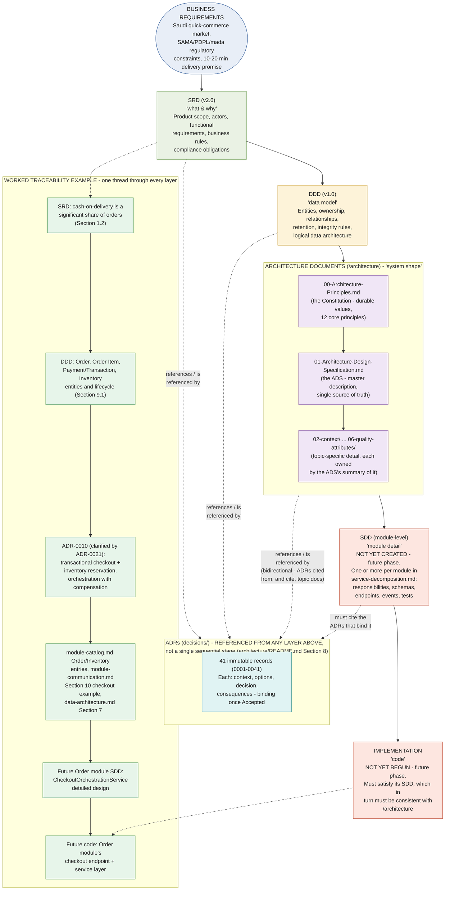
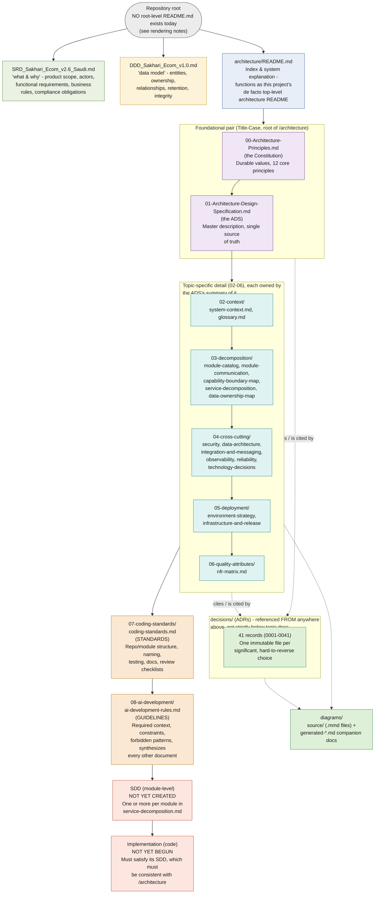
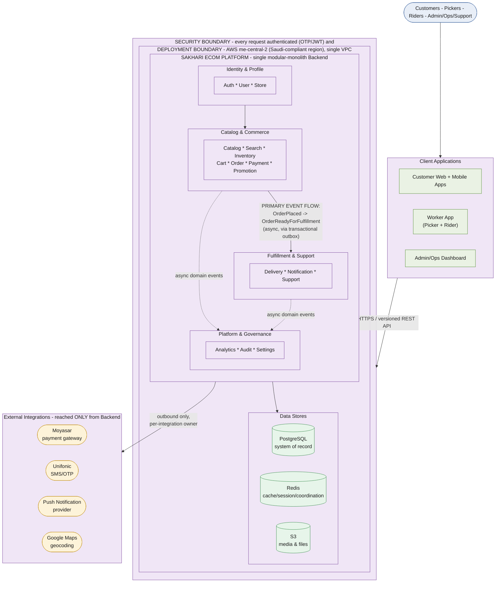

```mermaid
flowchart TB
    subgraph META["Meta"]
        a1["0001\nRecord architecture decisions"]
    end

    subgraph BACKFILL["Foundation backfill (0002-0009, 0017) - decisions/README.md:\n'ADRs 0002-0017 backfill decisions already implicit\nin the finalized SRD and the ADS'"]
        direction LR
        a2["0002\nModular monolith"]
        a3["0003\nPostgreSQL SoT"]
        a4["0004\nRedis cache/coord only"]
        a5["0005\nTypeScript stack"]
        a6["0006\nReact Native (Customer+Worker)"]
        a7["0007\nNext.js (Customer Web)"]
        a8["0008\nReact Admin Dashboard"]
        a9["0009\nModule ownership, no cross-repo access"]
        a17["0017\nVersioned APIs from day one"]
    end

    subgraph DATACONV["Data conventions (0013-0016, 0018-0019)"]
        direction LR
        a13["0013\nULIDs\n(SUPERSEDED)"]
        a18["0018\nUUID primary keys\n(SUPERSEDED)"]
        a19["0019\nRestore ULID PKs\n(current, effective)"]
        a14["0014\nUTC timestamp storage"]
        a15["0015\nInteger halala money"]
        a16["0016\nObject storage (S3)"]
    end

    subgraph EVENTSTXN["Events & Transactions (0010-0011, 0021, 0029)"]
        direction LR
        a10["0010\nTransactional checkout +\ninventory reservation\n(historical)"]
        a21["0021\nCheckout txn boundary\nclarification (OPERATIVE)"]
        a11["0011\nEvent-driven async side effects"]
        a29["0029\nPostgreSQL transactional outbox"]
    end

    subgraph SECURITY["Security (0012, 0026-0027, 0039-0041)"]
        direction LR
        a12["0012\nRBAC, fine-grained permissions"]
        a26["0026\nJWT + rotating refresh tokens"]
        a27["0027\nOTP-first authentication"]
        a39["0039\nOTP abuse protection defaults"]
        a40["0040\nStep-up auth, privileged roles"]
        a41["0041\nStore-scoped RBAC"]
    end

    subgraph RECONCILE["Reconciliation & finalization (0020-0028) - decisions/README.md:\n'close the major open architecture gaps found before SDD work'"]
        direction LR
        a20["0020\nModule ownership reconciliation\n(+ Support module)"]
        a22["0022\nMoyasar payment gateway"]
        a23["0023\nUnifonic SMS/OTP"]
        a24["0024\nAWS me-central-2 region"]
        a25["0025\nNestJS backend framework"]
        a28["0028\nCDN for public content"]
    end

    subgraph ARR1["ARR-1 remediation (0029-0033) - decisions/README.md:\n'close the ARR readiness blockers'"]
        direction LR
        a30["0030\nProduction deployment topology"]
        a31["0031\nProduction readiness targets"]
        a32["0032\nExternal integration resilience"]
        a33["0033\nSecurity & business-rule closure"]
    end

    subgraph DELIVERY["Delivery (0034-0036)"]
        direction LR
        a34["0034\nDelivery batching\n(multi-order)"]
        a35["0035\nDelivery-collected\npayment event"]
        a36["0036\nDelivery failed/\nrejected events"]
    end

    subgraph PAYMENTAREA["Payment (0037-0038)"]
        direction LR
        a37["0037\nPayment ledger"]
        a38["0038\nLine-item partial refunds"]
    end

    %% Supersession / clarification chains - EXPLICIT in decisions/README.md
    a13 ==>|SUPERSEDED BY| a18
    a18 ==>|SUPERSEDED BY| a19
    a10 -.->|CLARIFIED BY| a21

    %% Verified "Related ADRs" edges (from each ADR's own Related section)
    a10 --> a3
    a10 --> a4
    a10 --> a11
    a29 --> a3
    a29 --> a4
    a29 --> a11
    a30 --> a2
    a30 --> a3
    a30 --> a4
    a30 --> a16
    a30 --> a24
    a30 --> a28
    a30 --> a29
    a34 --> a2
    a34 --> a9
    a34 --> a11
    a34 --> a17
    a34 --> a20
    a34 --> a21
    a34 --> a29
    a34 --> a33
    a35 --> a9
    a35 --> a11
    a35 --> a20
    a35 --> a21
    a35 --> a29
    a35 --> a33
    a36 --> a9
    a36 --> a11
    a36 --> a20
    a36 --> a21
    a37 --> a9
    a37 --> a14
    a37 --> a15
    a37 --> a20
    a37 --> a22
    a37 --> a29
    a37 --> a32
    a38 --> a15
    a38 --> a20
    a38 --> a21
    a38 --> a33
    a38 --> a37

    classDef meta fill:#ececec,stroke:#666666,color:#1a1a1a
    classDef backfill fill:#e8eef7,stroke:#4a6fa5,color:#1a1a1a
    classDef dataconv fill:#eaf2e4,stroke:#5a8f3c,color:#1a1a1a
    classDef eventstxn fill:#fdf3d9,stroke:#c99a2e,color:#1a1a1a
    classDef security fill:#f0e6f6,stroke:#7c4a9e,color:#1a1a1a
    classDef reconcile fill:#e0f3f3,stroke:#2f8f8f,color:#1a1a1a
    classDef arr1 fill:#fde6e0,stroke:#c0533c,color:#1a1a1a
    classDef delivery fill:#dff0d8,stroke:#3f8f52,color:#1a1a1a
    classDef payment fill:#fbe8d3,stroke:#b5822a,color:#1a1a1a
    classDef superseded stroke-dasharray: 4 2

    class a1 meta
    class a2,a3,a4,a5,a6,a7,a8,a9,a17 backfill
    class a13,a18,a19,a14,a15,a16 dataconv
    class a10,a21,a11,a29 eventstxn
    class a12,a26,a27,a39,a40,a41 security
    class a20,a22,a23,a24,a25,a28 reconcile
    class a30,a31,a32,a33 arr1
    class a34,a35,a36 delivery
    class a37,a38 payment
    class a13,a18 superseded
```

# Sakhari Ecom — Documentation & Governance Diagrams

| | |
|---|---|
| **Version** | 1.0 |
| **Status** | Generated from the approved documentation set. **No architecture decision was made or changed while producing this document.** Every layer, relationship, and status below traces to `architecture/README.md`, `decisions/README.md`, or the individual ADR files. |
| **Scope** | Documentation and governance diagrams — how the documentation set itself is organized, traced, and related. Distinct from the structural (`generated-diagrams.md`), business-flow (`generated-business-flow-diagrams.md`), and technical (`generated-technical-diagrams.md`) diagram sets, which all show the *system*; these show the *documentation governing the system*. |
| **Source of truth** | `architecture/README.md` (all sections), `architecture/decisions/README.md` (full ADR index and lifecycle), individual ADR files (0010, 0021, 0029, 0030, 0034–0038 — read in full for verified cross-references), `01-Architecture-Design-Specification.md`, `02-context/system-context.md`, `03-decomposition/module-catalog.md`. |
| **Diagram source files** | `diagrams/source/decision-traceability.mmd`, `adr-relationships.mmd`, `documentation-hierarchy.mmd`, `architecture-overview.mmd` — this document embeds them for convenience; the `.mmd` files are authoritative per `diagrams/README.md`. |

---

## 0. Reported Discrepancies Between the Request and the Approved Documentation

Per instruction, nothing below was invented — each item is either rendered exactly as the source documents describe, or flagged here instead of guessed.

1. **ADRs are not a discrete sequential stage between DDD and Architecture Documents.** The requested traceability chain lists `DDD → ADRs → Architecture Documents`. `architecture/README.md` Section 8 states the opposite explicitly: ADRs are "the record of individual significant choices, **referenced from anywhere above**" — not one link in a straight chain, but a cross-cutting record cited by (and citing) the SRD, the DDD, and any architecture document, continuously, not in a fixed position. Diagram 1 renders the requested top-to-bottom chain (Business Requirements → SRD → DDD → Architecture Documents → SDD → Implementation) but draws ADRs as a **cross-referenced layer** connected to every stage with dashed "references/is referenced by" edges, matching what the source document actually says rather than asserting a strict sequential position ADRs don't have.
2. **SDD and Implementation do not exist yet.** `architecture/README.md`'s own "Current status" section states: "Authoring per-module SDDs and beginning implementation are the natural next phases of work." Both are rendered in Diagrams 1 and 3 as explicitly future/not-yet-created stages, not as if they were already populated documents or code.
3. **No repository-root `README.md` exists.** The requested Documentation Hierarchy names "README" as its top node. This repository has no root-level `README.md` — only `architecture/README.md` (which explicitly calls itself "the architecture layer... index & system explanation") and two narrower sub-READMEs (`decisions/README.md`, `diagrams/README.md`). Diagram 3 renders `architecture/README.md` as the closest existing analog to the requested "README" node and flags the missing repository-root README explicitly on the diagram, rather than assuming one exists.
4. **Not every ADR's full "Related ADRs" list was re-verified in this session.** Diagram 2 draws explicit relationship edges only for the eight ADRs whose "Related ADRs" footer this session actually read in full (0010, 0029, 0030, 0034, 0035, 0036, 0037, 0038) plus the three explicit supersession/clarification relationships `decisions/README.md` states outright (0013→0018→0019, 0010 clarified by 0021). The remaining ADRs are grouped into architecture-area clusters using `decisions/README.md`'s own narrative index text (its exact grouping language, e.g. "ADRs 0002–0017 backfill decisions already implicit in the finalized SRD and the ADS") rather than asserting individual pairwise relationships this session did not verify. Each ADR's own file is the authoritative source for its complete "Related" section.

Everything else requested — every ADR (all 41), their status and supersession relationships, the full documentation folder structure, and the executive overview's system/modules/integrations/event flow/data stores/security boundary/deployment boundary — is drawn directly from the approved documents with no invention.

---

## 1. Architecture Decision Traceability

### Purpose
Show how a business requirement becomes running code: the path from Business Requirements through the SRD, DDD, architecture documents, ADRs, SDD, and Implementation — with a worked example tracing one real decision (cash-on-delivery checkout) through every layer.

### Description
Renders the chain `architecture/README.md` states at its top (`SRD → DDD → /architecture → SDD → Implementation`) extended with Business Requirements at the top (the source every architecture document must trace back to, per Section 3: "every architecture document must be traceable to something the SRD actually says") and ADRs drawn as a cross-cutting reference layer rather than a fixed sequential stage — see Section 0, item 1. The `/architecture` layer's own internal order (Constitution → ADS → topic documents) is shown nested, per `architecture/README.md`'s second internal-hierarchy diagram. SDD and Implementation are both marked as future, not-yet-existing phases (Section 0, item 2). A worked example (SRD's cash-on-delivery fact → DDD's Order/Payment entities → ADR-0010/0021 → the architecture documents that cite them → a future Order SDD → future code) makes the abstract chain concrete.

### Mermaid Code

### Rendering Notes
- The solid top-to-bottom chain matches the requested layer order exactly; the dashed edges into `ADRLAYER` are what keep the diagram honest about ADRs' actual documented role (Section 0, item 1) without abandoning the requested visual shape.
- `sdd` and `impl` are styled distinctly (red-tinted) specifically to signal "future, does not exist yet" — this is a deliberate visual distinction, not a rendering accident.
- The `WORKED` subgraph is this diagram's concrete proof that the abstract chain is real and traceable today, as far as the documentation currently goes (it stops at "future" for the SDD/implementation nodes, honestly).

### Referenced ADRs
ADR-0001 (record architecture decisions — establishes the ADR practice itself), ADR-0010 (transactional checkout, historical), ADR-0021 (checkout transaction boundary clarification, operative — used in the worked example).

### Referenced Documents
`architecture/README.md` (primary source — the two header diagrams and Sections 3, 4, 8), `SRD_Sakhari_Ecom_v2.6_Saudi.md` Section 1.2, `DDD_Sakhari_Ecom_v1.0.md` Section 9.1, `03-decomposition/module-catalog.md`, `03-decomposition/module-communication.md` Section 10, `04-cross-cutting/data-architecture.md` Section 7.

---

## 2. ADR Relationship Diagram

### Purpose
Show every ADR (all 41), grouped by the architecture area it affects, with explicit supersession/clarification chains and verified cross-ADR dependency edges.

### Description
Every ADR from `decisions/README.md`'s index is represented, grouped into the same clusters that index's own narrative text describes: the Meta record (ADR-0001), the Foundation backfill (0002–0017, minus data-convention ADRs), Data Conventions (0013–0016, 0018–0019, including the ULID→UUID→ULID supersession chain), Events & Transactions, Security, Reconciliation & Finalization (0020–0028), ARR-1 Remediation (0029–0033), Delivery (0034–0036), and Payment (0037–0038). Three relationships are drawn as explicit, documented facts: ADR-0013 was superseded by ADR-0018, which was itself superseded by ADR-0019 (the current, effective identifier decision); ADR-0010 was clarified (not superseded) by ADR-0021. Beyond these, dependency edges are drawn only where this session verified the specific ADR's own "Related ADRs" footer — see Section 0, item 4, for exactly which eight ADRs that covers and why the rest are area-clustered rather than individually cross-referenced.

### Mermaid Code

### Rendering Notes
- **Supersession edges (`==>`) are visually distinct** from ordinary "related" edges (`-->`) and the "clarified by" edge (`-.->`) — status change is a different, more consequential kind of relationship than a citation, and the diagram marks it accordingly.
- **Nodes 0031, 0012, 0026, 0027, 0039, 0040, 0041 and most of the Reconciliation cluster have no outgoing "related" edges drawn**, not because they have no relationships (several clearly do — ADR-0041's store-scoped RBAC obviously relates to ADR-0012's RBAC foundation, for instance), but because this session did not verify their specific footers. Drawing a plausible-looking edge here would be exactly the kind of invention the task instructs against; their own files are authoritative.
- Area-cluster subgraph titles quote or closely paraphrase `decisions/README.md`'s own narrative index text — these are not new groupings this diagram invented, they restate what that document already says about which ADRs belong together and why.

### Referenced ADRs
Every ADR from 0001 through 0041 is a node on this diagram.

### Referenced Documents
`decisions/README.md` (primary source — full index, lifecycle table, and narrative grouping paragraphs), plus the individual files for ADR-0010, ADR-0021, ADR-0029, ADR-0030, ADR-0034, ADR-0035, ADR-0036, ADR-0037, ADR-0038 (source for the verified "Related ADRs" edges).

---

## 3. Documentation Hierarchy

### Purpose
Visualize the full documentation set's structure — from the repository root through the architecture folder's internal layering, ADRs, coding standards, AI guidelines, to the future SDD and implementation phases.

### Description
Drawn from `architecture/README.md` Section 1 (folder structure), Section 2 (purpose of every document), Section 4 (order of authorship — which establishes the dependency direction between layers), and Section 5 (stability classification). The Constitution and the ADS form a foundational pair at the root of `/architecture`; five numbered topic-detail folders (`02-context/` through `06-quality-attributes/`) each elaborate a section the ADS already summarizes; `decisions/` (ADRs) sits alongside as a cross-referenced record rather than strictly beneath the topic docs; `07-coding-standards/` (Standards) and `08-ai-development/` (Guidelines) sit downstream, each synthesizing what precedes it. SDD and Implementation are both rendered as explicitly future phases (Section 0, item 2), and the requested "README" node is rendered as `architecture/README.md` with the missing repository-root README flagged directly on the diagram (Section 0, item 3).

### Mermaid Code

### Rendering Notes
- The straight-line chain inside `TOPICDOCS` (context → decomp → crosscutting → deployment → nfr) reflects `architecture/README.md` Section 4's authorship *order*, not a runtime or citation dependency between those folders — later topic documents build on earlier ones being stable, but a reader can consult any of them independently, per Section 6's own "any document can be understood in isolation" heading convention.
- `diagramsDir` is linked with dashed connectors to both `ADRDIR` and `TOPICDOCS` because diagrams illustrate prose documents by reference (`diagrams/README.md`'s own "Referencing" rule) — it is a downstream, illustrative layer, not a new source of truth.
- The `root` node's label states the missing-README fact directly on the diagram itself, not only in this document's prose, so the gap is visible to anyone viewing the rendered image alone.

### Referenced ADRs
None directly — this diagram illustrates documentation structure, not a technical decision. ADR-0001 (which established the practice of recording ADRs at all) is the closest conceptual link, shown as a node inside `ADRDIR`'s represented set.

### Referenced Documents
`architecture/README.md` (primary source, all sections), `architecture/decisions/README.md`, `architecture/diagrams/README.md`, `SRD_Sakhari_Ecom_v2.6_Saudi.md`, `DDD_Sakhari_Ecom_v1.0.md`.

---

## 4. Architecture Overview Diagram

### Purpose
A single, executive-level summary of the entire system — suitable as the first diagram a reader sees when opening the architecture documentation — showing the system, its module clusters, external integrations, the primary event flow, major data stores, the security boundary, and the deployment boundary in one page.

### Description
Compresses the detail already established across `01-Architecture-Design-Specification.md`, `02-context/system-context.md`, `03-decomposition/module-catalog.md`, `04-cross-cutting/security-and-compliance.md`, and `05-deployment/infrastructure-and-release.md` into one publication-quality view. The sixteen backend modules are grouped into the same four capability tiers used consistently across this documentation set's other diagrams (Identity & Profile; Catalog & Commerce; Fulfillment & Support; Platform & Governance) rather than listed individually, keeping the diagram legible at executive altitude. Two nested boundaries are drawn explicitly, matching the architecture's own trust model: a **security boundary** (every request authenticated and authorized fresh, regardless of client claims) wrapping a **deployment boundary** (the AWS `me-central-2` VPC). The single most important event flow — `OrderPlaced` leading, via the transactional outbox, to `OrderReadyForFulfillment` — is called out by name as the primary flow, with other async event traffic shown more generically.

### Mermaid Code

### Rendering Notes
- **This diagram intentionally omits detail already covered elsewhere.** It does not show individual module dependency edges (that's `l3-module-dependencies.mmd`), the full event catalog (that's `event-architecture.mmd`), or RBAC/OTP mechanics (that's `security-architecture.mmd`) — an executive overview that tried to show everything would fail at being an overview. Each omission is a deliberate legibility choice consistent with `diagrams/README.md`'s own "one diagram, one concern" principle, applied here at the top of the whole set rather than to one narrow topic.
- The four module clusters are this documentation set's own recurring grouping (already used in `business-capability-map.mmd` and `data-ownership-diagram.mmd`), reused here for visual consistency across the full diagram catalog — a reader who has seen one of those diagrams recognizes the same grouping here.
- The nested `SECBOUNDARY` → `DEPLOYBOUNDARY` → `BACKEND` structure is a deliberate visual nesting, not just a label choice: it shows that the security boundary (an application-level concept — authentication/authorization) and the deployment boundary (a network/infrastructure-level concept — the VPC) are two different, overlapping trust boundaries around mostly the same substance, exactly as `system-context.md` and `infrastructure-and-release.md` describe them independently.
- Recommended placement: top of `architecture/README.md`, immediately after the title and before Section 1, as the very first visual a reader encounters — consistent with the task's own instruction.

### Referenced ADRs
ADR-0002 (modular monolith), ADR-0012 (RBAC), ADR-0017 (versioned APIs), ADR-0022 (Moyasar), ADR-0023 (Unifonic), ADR-0024 (AWS me-central-2), ADR-0026 (JWT), ADR-0027 (OTP-first authentication), ADR-0029 (transactional outbox — the primary event flow's durability mechanism), ADR-0030 (production deployment topology), ADR-0041 (store-scoped RBAC).

### Referenced Documents
`01-Architecture-Design-Specification.md` (whole-system summary, primary source for this diagram's scope), `02-context/system-context.md`, `03-decomposition/module-catalog.md`, `03-decomposition/capability-boundary-map.md` (module clustering), `04-cross-cutting/security-and-compliance.md` (security boundary), `05-deployment/infrastructure-and-release.md` (deployment boundary).

---

## Appendix: Source File Index

| Diagram | Source file | Illustrates (primary document) |
|---|---|---|
| 1. Architecture Decision Traceability | `diagrams/source/decision-traceability.mmd` | `architecture/README.md` |
| 2. ADR Relationship Diagram | `diagrams/source/adr-relationships.mmd` | `decisions/README.md` |
| 3. Documentation Hierarchy | `diagrams/source/documentation-hierarchy.mmd` | `architecture/README.md` |
| 4. Architecture Overview Diagram | `diagrams/source/architecture-overview.mmd` | `01-Architecture-Design-Specification.md` (executive summary) |

All four `.mmd` files carry a header comment naming the document(s) they illustrate and the date last verified against them (2026-07-30), per `diagrams/README.md`'s "Referencing" rule. These are documentation and governance diagrams — how the documentation set itself is organized — distinct from and complementary to the structural (`generated-diagrams.md`), business-flow (`generated-business-flow-diagrams.md`), and technical (`generated-technical-diagrams.md`) diagram sets, which all illustrate the system the documentation describes.
