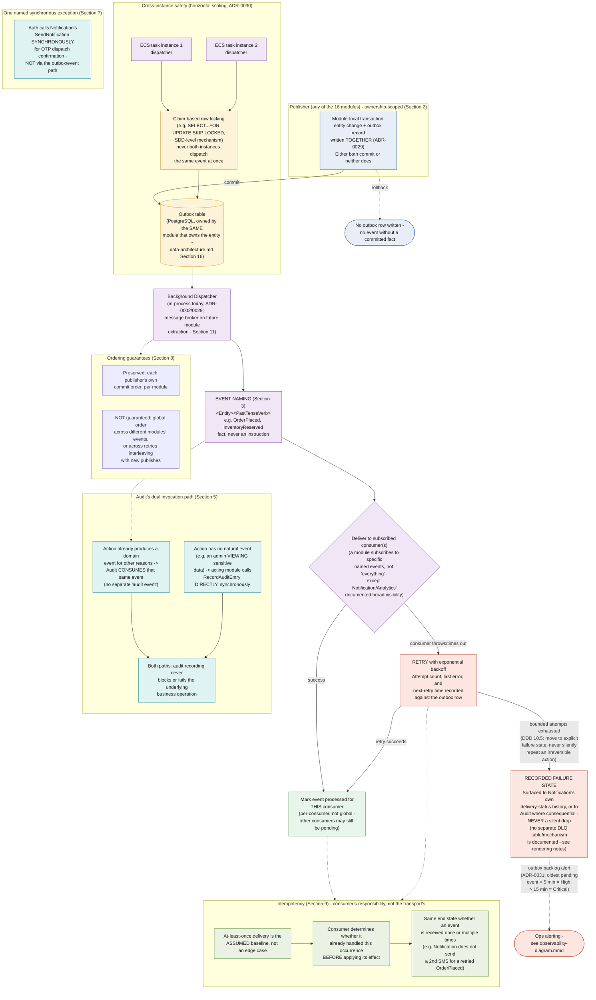
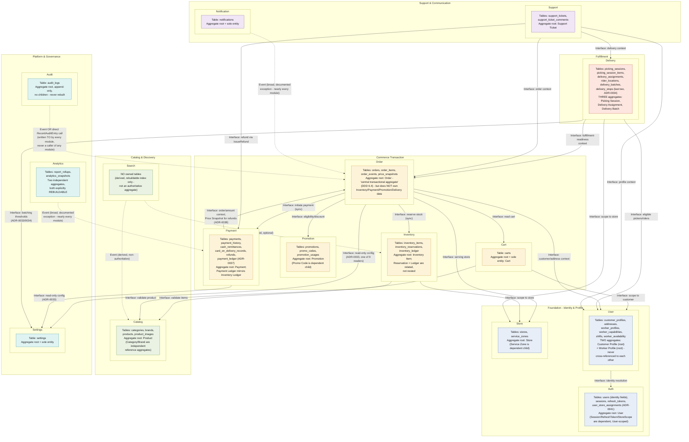
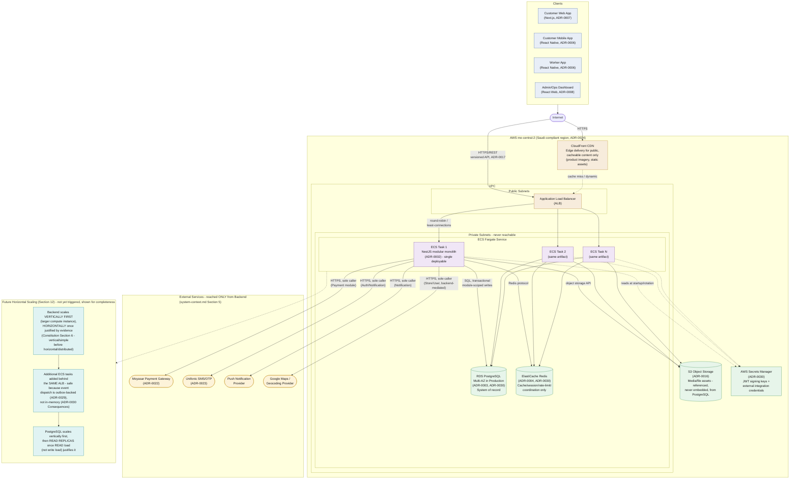
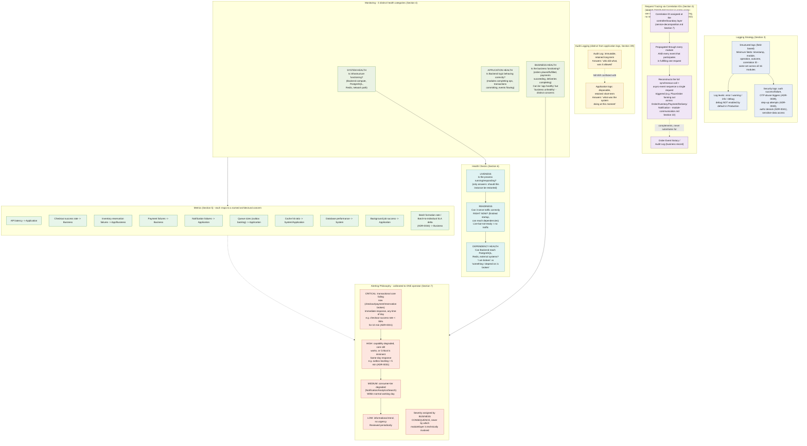

```mermaid
flowchart TD
    subgraph AUTHN["AUTHENTICATION FLOW (Section 4) - phone-based, OTP-driven, NO passwords anywhere"]
        client(["Client (any actor:\nCustomer/Picker/Rider/Admin/Ops/Support)"]) -->|"1. request login code"| reqOtp["Auth: RequestOtp"]
        reqOtp --> otpAbuse{"OTP ABUSE PROTECTION (ADR-0039)\nMax 5 requests/hour/phone,\n60s resend cooldown,\ndevice/IP throttling (independent)"}
        otpAbuse -->|"limit exceeded"| lockout["30-min temporary lockout\nProgressive backoff applied"]
        otpAbuse -->|"within limits"| syncNotif["2. Auth calls Notification.SendNotification\nSYNCHRONOUSLY (the ONE named exception -\nneeds dispatch confirmation before\ntelling client to expect a code)"]
        syncNotif --> extSms["3. Notification -> external\nSMS/OTP Provider (Unifonic, ADR-0023)"]
        extSms --> otpIssued["OTP issued: 6 digits,\nexpires in 5 minutes"]
        otpIssued --> verifyOtp["4. Client submits code ->\nAuth: VerifyOtp\n(max 5 attempts per issued code)"]
        verifyOtp -->|"invalid / expired"| otpFail["Verification fails\n(counts toward attempt ceiling)"]
        verifyOtp -->|"valid"| issueTokens["5. Auth issues token pair\n+ establishes session"]
        issueTokens --> publishAuth["Auth publishes:\nUserAuthenticated, OtpRequested\n(audit scope regardless of outcome)"]
    end

    subgraph JWTSEC["JWT (Section 5)"]
        issueTokens --> accessToken["Access Token (JWT)\nTTL: 15 minutes\nCarries identity + role/permission claims\nVerified in-process via ValidateToken -\nNOT itself an authorization decision"]
    end

    subgraph REFRESH["Refresh Tokens & Session Management (Section 6)"]
        issueTokens --> refreshToken["Refresh Token\nTTL: 7 days idle / 30 days absolute"]
        refreshToken --> rotation["ROTATION ON USE:\neach refresh issues a NEW\naccess+refresh pair and\ninvalidates the one just used\n(single-use, never reused)"]
        rotation --> reuseCheck{"Presented refresh token\nalready rotated (reused)?"}
        reuseCheck -->|"yes - possible compromise"| invalidateFamily["Invalidate ENTIRE token family\nForce full OTP re-authentication"]
        reuseCheck -->|"no"| newPair["New access/refresh pair issued"]
        newPair --> accessToken
        revoke["RevokeSession interface\n(logout, admin action,\nreuse-detection path)"] -.-> invalidateFamily
        pgAuth[("PostgreSQL: authoritative for\nsessions/refresh-token families/\nrevocation state\n(Redis = accelerator cache only)")]
        rotation -.-> pgAuth
    end

    subgraph AUTHZ["AUTHORIZATION FLOW / PERMISSION EVALUATION ORDER (Section 7, ADR-0041)"]
        apiReq(["Any API request carrying\na valid access token"]) --> step1["STEP 1: ValidateToken\n(caller is authenticated)"]
        step1 -->|"fail"| deny["DENY the request"]
        step1 -->|"pass"| step2["STEP 2: RBAC check -\ndoes the caller's role grant\nthe NAMED permission?\n(convention: &lt;resource&gt;:&lt;operation&gt;,\ne.g. order:manage, refund:approve)"]
        step2 -->|"fail"| deny
        step2 -->|"pass"| storeScoped{"STEP 3: Is this operation\nSTORE-SCOPED by nature?\n(skipped for global ops like\nsettings:manage)"}
        storeScoped -->|"no - not store-scoped"| allow["ALLOW - controller\ndelegates to module"]
        storeScoped -->|"yes"| storeCheck["STORE-SCOPED RBAC (ADR-0041):\nresource's store must be in\ncaller's ASSIGNED STORES\n(Permission AND Store Scope required -\ne.g. order:manage for Store A does\nNOT authorize against Store B)"]
        storeCheck -->|"store not assigned"| deny
        storeCheck -->|"store assigned"| allow
    end

    accessToken -.-> apiReq

    subgraph SCOPEDATA["Resource Scope data (Auth-internal, ADR-0041)"]
        assignedStores["Assigned Stores + Assigned Roles +\nAssigned Permissions - carried in\nValidateToken's returned claims,\nNOT a second separate lookup\n(Store = current only instance of a\nmore general Resource Scope concept)"]
    end
    storeCheck -.-> assignedStores

    subgraph STEPUP["STEP-UP MFA (Section 4A, ADR-0040)"]
        allow --> highRisk{"Is this a HIGH-RISK operation?\n(refund:approve, permission changes,\nsettings:manage, Payment Ledger\nAdjustment/Chargeback, sensitive\naudit access) AND caller is one of\nthe 4 privileged roles (Super Admin,\nOps Manager, Finance, Support Lead)?"}
        highRisk -->|"no"| proceed["Proceed to business logic"]
        highRisk -->|"yes"| stepUpChallenge["InitiateStepUpChallenge\nTOTP or approved enterprise MFA\n(SDD-level provider choice)\nEvaluated FRESH every time -\nNEVER cached across a session"]
        stepUpChallenge --> stepUpVerify{"VerifyStepUpChallenge"}
        stepUpVerify -->|"fail"| stepUpFailed["StepUpAuthenticationFailed\npublished (audit scope)\nDENY the operation"]
        stepUpVerify -->|"pass"| stepUpDone["StepUpAuthenticationCompleted\npublished (audit scope)"]
        stepUpDone --> proceed
    end

    classDef authn fill:#e8eef7,stroke:#4a6fa5,color:#1a1a1a
    classDef jwt fill:#f0e6f6,stroke:#7c4a9e,color:#1a1a1a
    classDef refresh fill:#eaf2e4,stroke:#5a8f3c,color:#1a1a1a
    classDef authz fill:#fdf3d9,stroke:#c99a2e,color:#1a1a1a
    classDef deny fill:#fde6e0,stroke:#c0533c,color:#1a1a1a
    classDef stepup fill:#e0f3f3,stroke:#2f8f8f,color:#1a1a1a

    class client,reqOtp,otpAbuse,lockout,syncNotif,extSms,otpIssued,verifyOtp,otpFail,issueTokens,publishAuth authn
    class accessToken jwt
    class refreshToken,rotation,reuseCheck,invalidateFamily,newPair,revoke,pgAuth refresh
    class apiReq,step1,step2,storeScoped,storeCheck,allow,assignedStores authz
    class deny deny
    class highRisk,stepUpChallenge,stepUpVerify,stepUpFailed,stepUpDone,proceed stepup
```

# Sakhari Ecom — Technical Architecture Diagrams

| | |
|---|---|
| **Version** | 1.0 |
| **Status** | Generated from the approved architecture. **No architecture decision was made or changed while producing this document.** Every mechanism, threshold, and state below traces to an ADR or a named cross-cutting document. |
| **Scope** | Technical/cross-cutting architecture diagrams — distinct from the structural diagrams (`generated-diagrams.md`) and the business-flow diagrams (`generated-business-flow-diagrams.md`). These cover *how the system works underneath* the business flows: event delivery mechanics, data ownership, production infrastructure, security controls, and observability. |
| **Source of truth** | `04-cross-cutting/integration-and-messaging.md`, `03-decomposition/data-ownership-map.md`, `05-deployment/infrastructure-and-release.md`, `04-cross-cutting/security-and-compliance.md`, `04-cross-cutting/observability-and-operations.md`; ADR-0012, 0024, 0029, 0030, 0031, 0039, 0040, 0041. |
| **Diagram source files** | `diagrams/source/event-architecture.mmd`, `data-ownership-diagram.mmd`, `deployment-diagram.mmd`, `security-architecture.mmd`, `observability-diagram.mmd` — this document embeds them for convenience; the `.mmd` files are authoritative per `diagrams/README.md`. |

---

## 0. Reported Discrepancies Between the Request and the Approved Architecture

Per instruction, nothing below was invented — each item is either rendered exactly as the source documents describe, or flagged here instead of guessed.

1. **"Dead-letter handling" is not a named mechanism in the approved architecture.** `integration-and-messaging.md` Section 8 defines the actual behavior: a consumer that exhausts its bounded retry attempts has the event "surfaced as a recorded failure — visible to Notification's own delivery-status history where relevant, or to Audit where the failure itself is consequential — never a silent drop." There is no documented dead-letter queue/table, no separate DLQ storage, and no DLQ-specific reprocessing workflow. Diagram 1 renders the actual documented behavior (a "Recorded Failure State") under the requested heading and flags the terminology gap explicitly on the diagram itself, rather than inventing a DLQ structure the architecture doesn't describe.
2. **"Distributed tracing" is not the term the architecture uses, and for a specific reason.** The Backend is a single modular-monolith deployable (ADR-0002) — there is no network hop between modules for a trace to cross. `observability-and-operations.md` Section 3 defines **correlation-ID-based request tracing**: a correlation ID assigned at the controller boundary, propagated through every module and event participating in one request, letting a single customer action be reconstructed as one story. Diagram 5 renders this under the requested "distributed tracing" heading with an explicit note that it is in-process request tracing, not a distributed-systems trace across a network — the mechanism is real and documented, only the "distributed" framing doesn't match a single-deployable architecture.
3. **"Load Balancer" maps to the documented Application Load Balancer (ALB), not a generic term.** ADR-0030 names the ALB specifically, in front of ECS Fargate tasks. Rendered as specified in the source, not a generic placeholder.

Everything else requested — the transactional outbox, domain events, consumers, retry, idempotency, event publishing; every module's owned aggregates/entities/tables and cross-module references; clients, internet, load balancer, backend, Redis, PostgreSQL, storage, external services, future horizontal scaling; OTP, step-up MFA, JWT, refresh tokens, RBAC, store-scoped RBAC, permission evaluation, authentication/authorization flows; logging, metrics, health checks, alerting, audit logging, monitoring — is drawn directly from the approved documents with no invention.

---

## 1. Event Architecture

### Purpose
Show how a domain event moves from a committed database transaction to durable delivery, through retry and idempotency guarantees, to every subscribed consumer — including the one named synchronous exception and Audit's dual invocation path.

### Explanation
Drawn from `integration-and-messaging.md` Sections 2–11 and ADR-0029 (the PostgreSQL transactional outbox). A publisher never raises an event as an independently-failable step — it writes the entity change and the outbox record in the **same** module-local transaction, so there is never a window where a fact is true but its announcement was lost, or vice versa. A background dispatcher (in-process today, per ADR-0002/0029) reads pending outbox rows and delivers to consumers, retrying with exponential backoff and recording attempt count/last error/next-retry time against the outbox row itself. Delivery is **at-least-once**, never exactly-once — the architecture deliberately accepts this and shifts the burden to consumer-side idempotency (Section 9) rather than building distributed-transaction or dedup-ledger machinery to chase exactly-once. Cross-instance safety (multiple ECS tasks running the dispatcher concurrently, ADR-0030) is handled by a claim-based row lock so two instances never dispatch the same event at once.

### Mermaid Code

### Rendering Notes
- **"Dead-letter handling"** is rendered as the documented "Recorded Failure State" — see Section 0, item 1, for why no DLQ structure is asserted.
- The `EXCEPTION` and `AUDITPATH` subgraphs are drawn separately from the main outbox flow because they are, respectively, a documented bypass of it (Auth→Notification) and a documented dual-path alongside it (Audit) — conflating either into the main flow would misstate how they actually work.
- `markProcessed` is explicitly per-consumer, not a single global "event done" flag — the diagram's wording reflects that an event can be processed for one consumer while still pending for another.

### Referenced ADRs
ADR-0011 (event-driven asynchronous side effects), ADR-0029 (PostgreSQL transactional outbox), ADR-0030 (production deployment topology — cross-instance dispatcher safety), ADR-0031 (production readiness targets — outbox backlog alert thresholds).

### Referenced Documents
`04-cross-cutting/integration-and-messaging.md` (primary source, all sections), `03-decomposition/module-communication.md` Section 6 (event ownership rule), `04-cross-cutting/data-architecture.md` Section 16 (outbox table ownership).

---

## 2. Data Ownership Diagram

### Purpose
Show every one of the sixteen backend modules with its owned aggregates, owned entities, owned tables, and how other modules are allowed to reference its data — reinforcing that ownership boundaries are absolute (no cross-module repository access, ADR-0009).

### Explanation
Drawn from `data-ownership-map.md` Section 12's per-module catalog (all sixteen modules) and Section 13's Ownership Matrix. Every module is the **sole writer** of its own tables, without exception — Search and Analytics are the two documented exceptions to "owns tables" (both hold only derived, rebuildable data, never an authoritative aggregate). Cross-module data access happens only through an owning module's public interface (solid edges) or a consumed event (dashed edges) — never a direct query against another module's tables. Two aggregates can share one module boundary without being related to each other (User's Customer Profile and Worker Profile aggregates are the clearest example); conversely, a module can be "central" to a workflow (Order, DDD's own "central transactional aggregate") without owning the data other modules contribute to that workflow.

### Mermaid Code

### Rendering Notes
- **Cross-module reference edges are a representative selection, not the full matrix.** `data-ownership-map.md` Section 13 documents 20+ entities with their full reader lists (30+ individual reader relationships); drawing every one would make the diagram unreadable. The edges shown cover every module's most architecturally significant reference (Order's orchestration reads, Payment's context read, Search's event-driven derivation, Settings' broad readership) — the full authoritative list remains Section 13's table.
- Solid edges are **Interface** access (synchronous public-interface call); dashed edges are **Event** access (asynchronous consumed event) — matching the Access Method column of Section 13's matrix exactly.
- Search's box explicitly states "NO owned tables" rather than omitting Search — the absence of ownership is itself an architectural fact worth showing (Principle 4.5's documented reporting/read-model exception), not something to leave implicit.

### Referenced ADRs
ADR-0009 (module ownership, no cross-module repository access), ADR-0020 (module ownership reconciliation), ADR-0033 (Settings readers), ADR-0034 (Delivery Batch/Stop), ADR-0037 (Payment Ledger), ADR-0038 (line-item refunds, Price Snapshot read), ADR-0041 (Store Scope Assignment).

### Referenced Documents
`03-decomposition/data-ownership-map.md` (primary source, all sections), `03-decomposition/module-catalog.md` (Public Interfaces/Events cross-reference).

---

## 3. Deployment Diagram

### Purpose
Show the production infrastructure topology: how a client request reaches the Backend, what the Backend depends on, how external services are reached, and how the system is designed to scale horizontally once evidence justifies it.

### Explanation
Drawn from `infrastructure-and-release.md` Sections 2–4 and 12, and ADR-0030 (production deployment topology). Production is one Backend deployable (the NestJS modular monolith, ADR-0002) running as an AWS ECS Fargate service behind an Application Load Balancer, in a VPC that separates public subnets (ALB, CloudFront edge) from private subnets (ECS tasks, RDS, ElastiCache) — the data stores and compute layer are never reachable directly from the internet, a networking-level expression of `system-context.md`'s "Infrastructure is reachable only from the Backend" rule. External services (Moyasar, Unifonic, Push, Google Maps) are reached exclusively from the Backend, each by its owning module. Horizontal scaling is explicitly a *future*, evidence-gated step — the Backend scales vertically first, and is safe to scale horizontally only because event dispatch is outbox-backed (PostgreSQL-durable, ADR-0029) rather than in-memory, so multiple ECS tasks never duplicate event delivery.

### Mermaid Code

### Rendering Notes
- **ECS Task 2 / Task N are drawn to depict the scaling *shape*, not a current fact.** Per Section 12, horizontal scaling is a future step, gated on evidence — Task 1 alone reflects today's baseline; Tasks 2/N and the `SCALING` subgraph are explicitly labeled as the future-scaling illustration the task requested, not an assertion that multiple instances run today.
- Only Task 1 is drawn with outbound edges to external services and secrets for legibility; per the architecture, every ECS task instance has identical outbound access — the omission on Task 2/N is a diagram-simplicity choice, not an architectural asymmetry.
- The dashed edges to Secrets Manager reflect that secrets are read (at startup/rotation), never written by the Backend at runtime — consistent with `security-and-compliance.md` Section 10's secrets rules.

### Referenced ADRs
ADR-0002 (modular monolith), ADR-0003 (PostgreSQL/RDS), ADR-0004 (Redis), ADR-0016 (S3), ADR-0017 (versioned APIs), ADR-0022 (Moyasar), ADR-0023 (Unifonic), ADR-0024 (AWS me-central-2), ADR-0029 (transactional outbox — what makes horizontal scaling safe), ADR-0030 (production deployment topology — primary source for this diagram).

### Referenced Documents
`05-deployment/infrastructure-and-release.md` (primary source, Sections 2–4, 12), `02-context/system-context.md` Section 6 (Infrastructure trust boundary), `04-cross-cutting/reliability-and-performance.md` (deeper scaling rationale, referenced not repeated).

---

## 4. Security Architecture

### Purpose
Show the complete authentication flow (OTP-based), token issuance and refresh lifecycle, the authorization flow (RBAC with store-scoped permission evaluation), and the step-up MFA gate for high-risk operations by privileged roles.

### Explanation
Drawn from `security-and-compliance.md` Sections 3–10 and ADR-0039 (OTP abuse protection), ADR-0040 (step-up authentication), ADR-0041 (store-scoped RBAC). There are no passwords anywhere in the system — every actor authenticates via phone-based OTP, with concrete abuse-protection defaults (5 requests/hour, 5 verify attempts/code, 60-second resend cooldown, 30-minute lockout). A successful verification issues a short-lived (15-minute) JWT access token and a longer-lived (7-day idle / 30-day absolute) refresh token with rotation-on-use and reuse detection — presenting an already-rotated refresh token invalidates the entire token family, forcing re-authentication. Authorization is evaluated fresh on every request in a strict order: authenticate (`ValidateToken`) → does the role grant the named `<resource>:<operation>` permission → if the resource is store-scoped, is that store in the caller's Assigned Stores. Four privileged roles (Super Admin, Operations Manager, Finance, Support Lead) must additionally pass a fresh step-up challenge (TOTP or enterprise MFA) before specific high-risk operations — evaluated every time, never cached across a session, independent of the OTP session's own validity.

### Mermaid Code

### Rendering Notes
- The full RBAC permission catalogue (16 modules × their named `<resource>:<operation>` permissions, `security-and-compliance.md` Section 7's table) is **not** reproduced node-by-node on this diagram — it would overwhelm the flow being illustrated. Two representative examples (`order:manage`, `refund:approve`) are shown; the complete catalogue is Section 7's own table, referenced rather than duplicated.
- Rider proof-of-delivery OTP (DDD Section 7.5) reuses this same OTP capability in a delivery context rather than a second mechanism — not drawn as a separate flow since it is architecturally identical to the login flow already shown, invoked by Delivery instead of a client login screen.
- The `accessToken -.-> apiReq` dashed edge is a diagram-linking connector (this is the same access token produced above, now presented on a later request) — not a new architectural relationship.

### Referenced ADRs
ADR-0012 (RBAC with fine-grained permissions), ADR-0026 (JWT session model), ADR-0027 (OTP-first authentication), ADR-0033 (token lifetimes, permission catalogue), ADR-0039 (OTP abuse protection defaults), ADR-0040 (step-up authentication for privileged roles), ADR-0041 (store-scoped RBAC).

### Referenced Documents
`04-cross-cutting/security-and-compliance.md` (primary source, Sections 3–10), `04-cross-cutting/technology-decisions.md` Sections 8–9 (JWT/OTP technology rationale, referenced not repeated), `03-decomposition/module-catalog.md` Section 4.1 (Auth's public interfaces).

---

## 5. Observability Diagram

### Purpose
Show how the system is watched and diagnosed: structured logging, correlation-ID-based request tracing, the three distinct health categories, the metrics that back them, health check tiers, and the alerting severity model — plus how audit logging is deliberately kept distinct from application logging.

### Explanation
Drawn from `observability-and-operations.md` Sections 3–7 and ADR-0031's initial numeric thresholds. Every log entry is structured with a consistent minimum field set across all sixteen modules, including a correlation ID assigned at the controller boundary and propagated through every module and event a single request touches — this is what lets a solo operator reconstruct a multi-module flow (like checkout) as one story instead of manually correlating sixteen modules' independent logs. Monitoring is deliberately split into three genuinely distinct questions — system health, application health, and business health — because a system can look application-healthy (no errors, normal latency) while being business-unhealthy (checkout success rate quietly dropping). Alerting is calibrated to exactly one operator: four severity tiers assigned strictly by business consequence, not by which module is technically involved, with concrete numeric thresholds (e.g., checkout success rate below 95% for 10 minutes is Critical).

### Mermaid Code

### Rendering Notes
- **"Distributed tracing"** is rendered as the documented correlation-ID request tracing mechanism — see Section 0, item 2, for why "distributed" doesn't match a single in-process deployable.
- Only 10 of the metrics table's rows are shown as individual nodes (all of them, in fact — `observability-and-operations.md` Section 5 names exactly these); none were added or omitted.
- The `MONITORING --> METRICS` and `bizHealth --> ALERTING` connector edges represent that metrics are organized by health category and that business-health signals drive alerting — they are structural/organizational links from the source document's own table structure, not new data-flow edges being asserted.

### Referenced ADRs
ADR-0031 (production readiness targets — numeric alert thresholds, RPO/RTO), ADR-0039 (OTP abuse-protection security-log content), ADR-0040 (step-up authentication security-log content), ADR-0041 (authorization-denial security-log content).

### Referenced Documents
`04-cross-cutting/observability-and-operations.md` (primary source, Sections 2–7), `04-cross-cutting/reliability-and-performance.md` Section 3 (availability allocation this document's monitoring priorities follow), `04-cross-cutting/security-and-compliance.md` Section 9 (audit as a security control), `03-decomposition/service-decomposition.md` Section 7 (Thin Controllers — where correlation IDs are assigned).

---

## Appendix: Source File Index

| Diagram | Source file | Illustrates (primary document) |
|---|---|---|
| 1. Event Architecture | `diagrams/source/event-architecture.mmd` | `04-cross-cutting/integration-and-messaging.md`, ADR-0029 |
| 2. Data Ownership Diagram | `diagrams/source/data-ownership-diagram.mmd` | `03-decomposition/data-ownership-map.md` |
| 3. Deployment Diagram | `diagrams/source/deployment-diagram.mmd` | `05-deployment/infrastructure-and-release.md`, ADR-0030 |
| 4. Security Architecture | `diagrams/source/security-architecture.mmd` | `04-cross-cutting/security-and-compliance.md`, ADR-0039/0040/0041 |
| 5. Observability Diagram | `diagrams/source/observability-diagram.mmd` | `04-cross-cutting/observability-and-operations.md`, ADR-0031 |

All five `.mmd` files carry a header comment naming the document(s) they illustrate and the date last verified against them (2026-07-30), per `diagrams/README.md`'s "Referencing" rule. These are technical/cross-cutting architecture diagrams, distinct from and complementary to the structural diagrams in `generated-diagrams.md` and the business-flow diagrams in `generated-business-flow-diagrams.md`.
